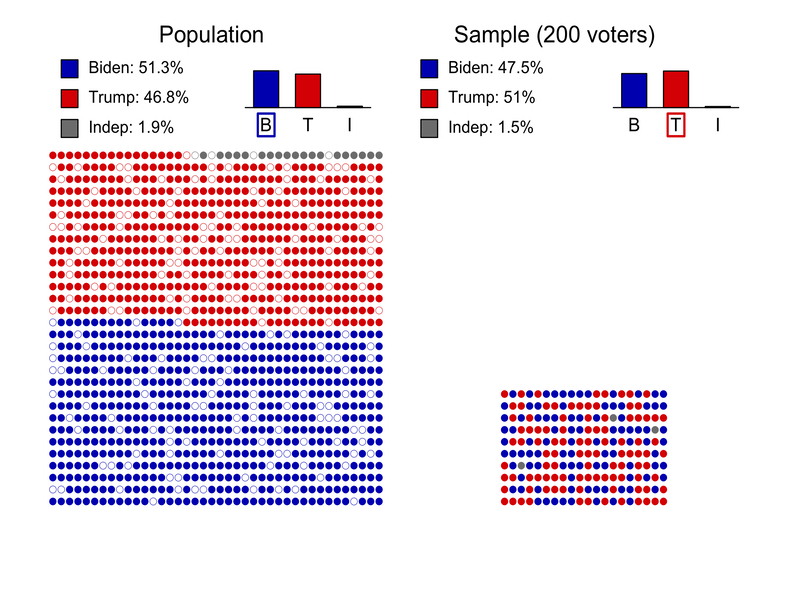

```{R, setup, include = F}
# devtools::install_github("dill/emoGG")
library(pacman)
p_load(
  broom, tidyverse,
  latex2exp, ggplot2, ggthemes, ggforce, viridis, extrafont, gridExtra,
  kableExtra, snakecase, janitor,
  data.table, dplyr, estimatr,
  lubridate, knitr, parallel,
  lfe,
  here, magrittr
)
# Define pink color
red_pink <- "#e64173"
turquoise <- "#20B2AA"
orange <- "#FFA500"
red <- "#fb6107"
blue <- "#2b59c3"
green <- "#8bb174"
grey_light <- "grey70"
grey_mid <- "grey50"
grey_dark <- "grey20"
purple <- "#6A5ACD"
slate <- "#314f4f"
# Dark slate grey: #314f4f
# Knitr options
opts_chunk$set(
  comment = "#>",
  fig.align = "center",
  fig.height = 7,
  fig.width = 10.5,
  warning = F,
  message = F
)
opts_chunk$set(dev = "svg")
options(device = function(file, width, height) {
  svg(tempfile(), width = width, height = height)
})
options(crayon.enabled = F)
options(knitr.table.format = "html")
# A blank theme for ggplot
theme_empty <- theme_bw() + theme(
  line = element_blank(),
  rect = element_blank(),
  strip.text = element_blank(),
  axis.text = element_blank(),
  plot.title = element_blank(),
  axis.title = element_blank(),
  plot.margin = structure(c(0, 0, -0.5, -1), unit = "lines", valid.unit = 3L, class = "unit"),
  legend.position = "none"
)
theme_simple <- theme_bw() + theme(
  line = element_blank(),
  panel.grid = element_blank(),
  rect = element_blank(),
  strip.text = element_blank(),
  axis.text.x = element_text(size = 18, family = "STIXGeneral"),
  axis.text.y = element_blank(),
  axis.ticks = element_blank(),
  plot.title = element_blank(),
  axis.title = element_blank(),
  # plot.margin = structure(c(0, 0, -1, -1), unit = "lines", valid.unit = 3L, class = "unit"),
  legend.position = "none"
)
theme_axes_math <- theme_void() + theme(
  text = element_text(family = "MathJax_Math"),
  axis.title = element_text(size = 22),
  axis.title.x = element_text(hjust = .95, margin = margin(0.15, 0, 0, 0, unit = "lines")),
  axis.title.y = element_text(vjust = .95, margin = margin(0, 0.15, 0, 0, unit = "lines")),
  axis.line = element_line(
    color = "grey70",
    size = 0.25,
    arrow = arrow(angle = 30, length = unit(0.15, "inches")
  )),
  plot.margin = structure(c(1, 0, 1, 0), unit = "lines", valid.unit = 3L, class = "unit"),
  legend.position = "none"
)
theme_axes_serif <- theme_void() + theme(
  text = element_text(family = "MathJax_Main"),
  axis.title = element_text(size = 22),
  axis.title.x = element_text(hjust = .95, margin = margin(0.15, 0, 0, 0, unit = "lines")),
  axis.title.y = element_text(vjust = .95, margin = margin(0, 0.15, 0, 0, unit = "lines")),
  axis.line = element_line(
    color = "grey70",
    size = 0.25,
    arrow = arrow(angle = 30, length = unit(0.15, "inches")
  )),
  plot.margin = structure(c(1, 0, 1, 0), unit = "lines", valid.unit = 3L, class = "unit"),
  legend.position = "none"
)
theme_axes <- theme_void() + theme(
  text = element_text(family = "Fira Sans Book"),
  axis.title = element_text(size = 18),
  axis.title.x = element_text(hjust = .95, margin = margin(0.15, 0, 0, 0, unit = "lines")),
  axis.title.y = element_text(vjust = .95, margin = margin(0, 0.15, 0, 0, unit = "lines")),
  axis.line = element_line(
    color = grey_light,
    size = 0.25,
    arrow = arrow(angle = 30, length = unit(0.15, "inches")
  )),
  plot.margin = structure(c(1, 0, 1, 0), unit = "lines", valid.unit = 3L, class = "unit"),
  legend.position = "none"
)
theme_set(theme_gray(base_size = 20))
# Column names for regression results
reg_columns <- c("Term", "Est.", "S.E.", "t stat.", "p-Value")
# Function for formatting p values
format_pvi <- function(pv) {
  return(ifelse(
    pv < 0.0001,
    "<0.0001",
    round(pv, 4) %>% format(scientific = F)
  ))
}
format_pv <- function(pvs) lapply(X = pvs, FUN = format_pvi) %>% unlist()
# Tidy regression results table
tidy_table <- function(x, terms, highlight_row = 1, highlight_color = "black", highlight_bold = T, digits = c(NA, 3, 3, 2, 5), title = NULL) {
  x %>%
    tidy() %>%
    select(1:5) %>%
    mutate(
      term = terms,
      p.value = p.value %>% format_pv()
    ) %>%
    kable(
      col.names = reg_columns,
      escape = F,
      digits = digits,
      caption = title
    ) %>%
    kable_styling(font_size = 20) %>%
    row_spec(1:nrow(tidy(x)), background = "white") %>%
    row_spec(highlight_row, bold = highlight_bold, color = highlight_color)
}
```

```{css, echo = F, eval = F}
@media print {
  .has-continuation {
    display: block !important;
  }
}
```

# Population and Sample - Example

.smallest[To fix ideas we will consider a simple example. The 2020 United States presidential election was the 59th quadrennial presidential election, held on November 3, 2020. According to the latest estimates the .hi.pink[Biden's team received 51.3% of the votes while Trumps' received 46.8%] <sup>.smallest[👋]</sup>. Naturally, the result of American elections are determined by the popular vote but suppose that we were interested in collecting data .hi-purple[before the vote] to assess if Biden's team will receive more than 50% of the votes].

```{R, out.width = "80%", echo = F}
include_graphics("pics/trump2.png")
```

.tiny[Source: Adapted from [fivethirtyeight.](https://projects.fivethirtyeight.com/trump-biden-election-map/)]

.footnote[.smallest[👋 More details on the results can be found [here](https://en.wikipedia.org/wiki/2020_United_States_presidential_election).]]

---

# Population and Sample - Example

.pull-left[.smaller[In this example, we will make the .purple[following assumptions for simplicity]:

- The American population of voters is composed of 1200 individuals (616 for Biden, 561 for Trump and 23 independents).
- We can perfectly sample the population (everyone is available, no double sampling, and the sampling is random).
- People don't change their mind and they don't lie.
]]

.pull-right[

```{R, out.width = "90%", echo = F}
include_graphics("pics/pop.jpg")
```

]

---

# Proportion Estimation

Suppose we ask  $n$ voters for which candidate (Biden, Trump or independent) they intend to vote in order to estimate the proportion of voters for Biden. For that we define the .hi.purple[random variables] $X_1, ..., X_n$ where $X_i$ is defined as:

.smaller[
.center[
`\(
X_i = \left\{
	\begin{array}{ll}
		1  & \mbox{if voter } i \mbox{ intends to vote for Biden}\\
		0 & \mbox{otherwise.}
	\end{array}
\right.
\)`
]
]


The random variables $X_1, ..., X_n$ are called a (random) .hi.purple[sample] and we refer to $n$ as the .hi.purple[sample size]. We let $p$ denote the (true) proportion of voters for Biden (which in this case is 51.3%). Then, we have


$$
\begin{align}
\color{#e64173}{\Pr \Big(} {X_i = 1} \color{#e64173}{\Big)} = p,
\end{align}
$$


where $\color{#e64173}{\Pr (} A \color{#e64173}{)}$ denote the .pink[probability] of the event $A$.

---

# Proportion Estimation

Using the random variables $X_1, ..., X_n$ we can define an .hi.purple[estimator] of $p$, which we often write as $\hat{p}$:


$$\hat{p} = \frac{1}{n} \sum_{i=1}^n X_i = \frac{\color{#e64173}{m}}{\color{#6A5ACD}{n}},$$


where $\color{#e64173}{m}$ and $\color{#6A5ACD}{n}$ denote, respectively, the number of voters in our sample in favor of Biden and the sample size.

In theory, any function of the data (i.e. $X_1, ..., X_n$) can be (at least in principle) an estimator. However, in this case $\hat{p}$ is the best possible estimator of $p$ <sup>.smallest[👋]</sup> and it is not useful (in this case) to search for better estimators.

.footnote[.smallest[👋] More precisely, this estimator is unbiased [(more info.)](https://en.wikipedia.org/wiki/Bias_of_an_estimator) and has the smallest possible variance [(more info.)](https://en.wikipedia.org/wiki/Variance) as it attains the Cramér–Rao bound [(more info.)](https://en.wikipedia.org/wiki/Cram%C3%A9r%E2%80%93Rao_bound).]
 
---

# Population and Sample - Example

.pull-left[
.smallest[
Consider a sample of $n = 10$ voters (randomly chosen in the population) a shown here 👉. In this case, we have 5 voters for Biden and 5 for Trump. We say that $x_1 = 1, ..., x_5 = 1, x_6 = 0, ..., x_{10}$ are .hi.purple[realizations] of the random variables $X_1, ..., X_{10}$.

We can now compute our estimator on the observed data (i.e. the realizations) and we obtain $\hat{p} = 0.5$. Therefore, .purple[our best guess] based on the available data is that 50% of the voters will vote for Biden. Unfortunately, this doesn't really help us. Let us try with a bigger sample size... say $n = 40$.
]]

.pull-right[

```{R, out.width = "90%", echo = F}
include_graphics("pics/sample1.jpg")
```

]

---

# Population and Sample - Example

```{R, out.width = "100%", echo = F}
include_graphics("pics/sample3.jpg")
```

---

# Population and Sample - Example

.center[]

---

# Population and Sample - Example

```{R, out.width = "100%", echo = F}

```

---

# Population and Sample - Example

```{R, out.width = "100%", echo = F}
include_graphics("pics/sample_n.jpg")
```

---

# Should we measure uncertainty?

(mingming: to improve)

- In our example, we are interested in knowing if $p$ is bigger or smaller than 50% but, unfortunately, $p$ is unknown (in general) and we use $\hat{p}$ instead.
- Our estimator $\hat{p}$ is not perfect and it is different from $p$. Also, we see that depending on $n$ we can get different answers (see $n = 200$ and $n = 600$).
- To address this issue we can try to assess the uncertainty of $\hat{p}$ (i.e. assess how different $\hat{p}$ and $p$ can be).
- .pink[Uncertainty can be measured in many different ways]. A common approach (in statistics) is to use .hi-purple[confidence intervals]. 
- In order to understand how such intervals can obtained, we will first present the .hi.purple[Central Limit Theorem], which states that: .turquoise[the sampling distribution of the sample means approaches a normal distribution as the sample size gets larger]. So, what does this means? 😟 

---


