```{R, setup, include = F}
# devtools::install_github("dill/emoGG")
library(pacman)
p_load(
  broom, tidyverse,
  latex2exp, ggplot2, ggthemes, ggforce, viridis, extrafont, gridExtra,
  kableExtra, snakecase, janitor,
  data.table, dplyr, estimatr,
  lubridate, knitr, parallel,
  lfe,
  here, magrittr
)
# Define pink color
red_pink <- "#e64173"
turquoise <- "#20B2AA"
orange <- "#FFA500"
red <- "#fb6107"
blue <- "#2b59c3"
green <- "#8bb174"
grey_light <- "grey70"
grey_mid <- "grey50"
grey_dark <- "grey20"
purple <- "#6A5ACD"
slate <- "#314f4f"
# Dark slate grey: #314f4f
# Knitr options
opts_chunk$set(
  comment = "#>",
  fig.align = "center",
  fig.height = 7,
  fig.width = 10.5,
  warning = F,
  message = F
)
opts_chunk$set(dev = "svg")
options(device = function(file, width, height) {
  svg(tempfile(), width = width, height = height)
})
options(crayon.enabled = F)
options(knitr.table.format = "html")
# A blank theme for ggplot
theme_empty <- theme_bw() + theme(
  line = element_blank(),
  rect = element_blank(),
  strip.text = element_blank(),
  axis.text = element_blank(),
  plot.title = element_blank(),
  axis.title = element_blank(),
  plot.margin = structure(c(0, 0, -0.5, -1), unit = "lines", valid.unit = 3L, class = "unit"),
  legend.position = "none"
)
theme_simple <- theme_bw() + theme(
  line = element_blank(),
  panel.grid = element_blank(),
  rect = element_blank(),
  strip.text = element_blank(),
  axis.text.x = element_text(size = 18, family = "STIXGeneral"),
  axis.text.y = element_blank(),
  axis.ticks = element_blank(),
  plot.title = element_blank(),
  axis.title = element_blank(),
  # plot.margin = structure(c(0, 0, -1, -1), unit = "lines", valid.unit = 3L, class = "unit"),
  legend.position = "none"
)
theme_axes_math <- theme_void() + theme(
  text = element_text(family = "MathJax_Math"),
  axis.title = element_text(size = 22),
  axis.title.x = element_text(hjust = .95, margin = margin(0.15, 0, 0, 0, unit = "lines")),
  axis.title.y = element_text(vjust = .95, margin = margin(0, 0.15, 0, 0, unit = "lines")),
  axis.line = element_line(
    color = "grey70",
    size = 0.25,
    arrow = arrow(angle = 30, length = unit(0.15, "inches")
  )),
  plot.margin = structure(c(1, 0, 1, 0), unit = "lines", valid.unit = 3L, class = "unit"),
  legend.position = "none"
)
theme_axes_serif <- theme_void() + theme(
  text = element_text(family = "MathJax_Main"),
  axis.title = element_text(size = 22),
  axis.title.x = element_text(hjust = .95, margin = margin(0.15, 0, 0, 0, unit = "lines")),
  axis.title.y = element_text(vjust = .95, margin = margin(0, 0.15, 0, 0, unit = "lines")),
  axis.line = element_line(
    color = "grey70",
    size = 0.25,
    arrow = arrow(angle = 30, length = unit(0.15, "inches")
  )),
  plot.margin = structure(c(1, 0, 1, 0), unit = "lines", valid.unit = 3L, class = "unit"),
  legend.position = "none"
)
theme_axes <- theme_void() + theme(
  text = element_text(family = "Fira Sans Book"),
  axis.title = element_text(size = 18),
  axis.title.x = element_text(hjust = .95, margin = margin(0.15, 0, 0, 0, unit = "lines")),
  axis.title.y = element_text(vjust = .95, margin = margin(0, 0.15, 0, 0, unit = "lines")),
  axis.line = element_line(
    color = grey_light,
    size = 0.25,
    arrow = arrow(angle = 30, length = unit(0.15, "inches")
  )),
  plot.margin = structure(c(1, 0, 1, 0), unit = "lines", valid.unit = 3L, class = "unit"),
  legend.position = "none"
)
theme_set(theme_gray(base_size = 20))
# Column names for regression results
reg_columns <- c("Term", "Est.", "S.E.", "t stat.", "p-Value")
# Function for formatting p values
format_pvi <- function(pv) {
  return(ifelse(
    pv < 0.0001,
    "<0.0001",
    round(pv, 4) %>% format(scientific = F)
  ))
}
format_pv <- function(pvs) lapply(X = pvs, FUN = format_pvi) %>% unlist()
# Tidy regression results table
tidy_table <- function(x, terms, highlight_row = 1, highlight_color = "black", highlight_bold = T, digits = c(NA, 3, 3, 2, 5), title = NULL) {
  x %>%
    tidy() %>%
    select(1:5) %>%
    mutate(
      term = terms,
      p.value = p.value %>% format_pv()
    ) %>%
    kable(
      col.names = reg_columns,
      escape = F,
      digits = digits,
      caption = title
    ) %>%
    kable_styling(font_size = 20) %>%
    row_spec(1:nrow(tidy(x)), background = "white") %>%
    row_spec(highlight_row, bold = highlight_bold, color = highlight_color)
}
```

```{css, echo = F, eval = F}
@media print {
  .has-continuation {
    display: block !important;
  }
}
```

```{r xaringan-tile-view, echo=FALSE}
xaringanExtra::use_tile_view()
xaringanExtra::use_panelset()
xaringanExtra::use_clipboard()
```

# Introduction

Welcome to the class ".hi-purple[Introduction to Statistics]"!

Throughout this class, we will use a platform called .hi-pink[Piazza] for the share of all the teaching materials and Q&A. 

```{R, out.width = "40%", echo = F}
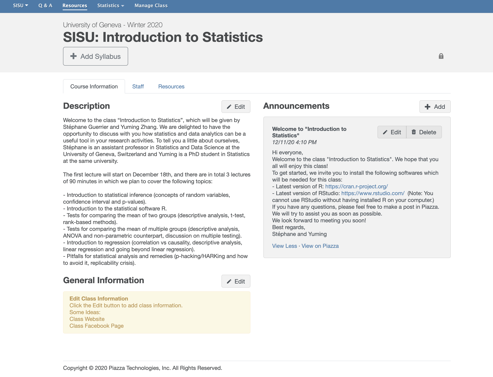
```

- Signup Link: [https://piazza.com/configure-classes/winter2020/sisu](https://piazza.com/configure-classes/winter2020/sisu)
- Access Code: .purple[statisfun]

---

# R and RStudio

.pull-left[
In this class, we will use the statistical software .hi-pink[R] together with the integrated development environment .hi-pink[R Studio], which can be downloaded with the following: 

- Latest version of R: [https://cran.r-project.org/](https://cran.r-project.org/)
- Latest version of R Studio: [https://www.rstudio.com/](https://www.rstudio.com/)

.hi-purple[Note:] You cannot use RStudio without having installed R on your computer.
]

.pull-right[

```{R, out.width = "100%", echo = F}
include_graphics("pics/r_first_then.png")
```

]

---

# What is statistics?

.pull-left[
.smaller[.hi-pink[Statistics] is a science that uses mathematics and computer science to deal with the collection, analysis, interpretation, and presentation of masses of numerical data. Informally, it is the .pink[science of learning from data].]
```{R, stat, out.width = "90%", echo = F}
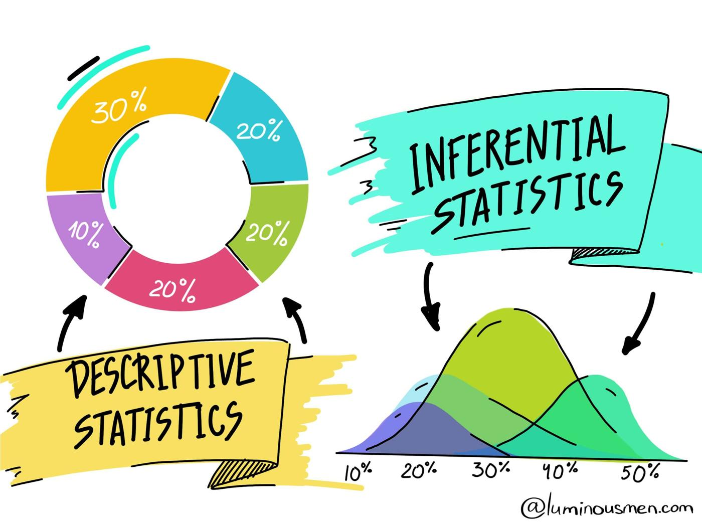
```
.tiny[Source: [luminousmen](luminousmen.com)]
]

.pull-right[
.smaller[.hi-purple[Statistics] is a crucial part of our life. However, .purple[statistical methods are often consciously (or not) misused]. This can lead to contradictory studies and conclusions (as seen during the current COVID-19 pandemic).]

```{R, torture, out.width = "80%", echo = F}
include_graphics("pics/data-torture.png")
```

.tiny[Source: [Atoz Markets](https://atozmarkets.com/news/untold-reality-of-p-hacking-in-finance/)]
]

---

# How can statistics be useful?

.smallest[Statistics can be used (among others) to

1. .purple[Visualize data] (e.g. propagation of COVID-19 in different countries).
2. .purple[Understand and interpret data] (e.g. main causes of cancer). 
3. .purple[Assess the validity of a hypothesis] (e.g. is a drug working?).
4. .purple[Make predictions] (e.g. predicting unemployment or risk indices).]

.smallest[Learning more about statistics allows to 

1. Better understand .pink[arguments based on data.]
2. Be able to apply .pink[critical thinking] about .pink[statistics used as evidence].
3. Understand how statistical associations are used to .pink[evaluate claims (hypotheses)] and .pink[assess causal connections.]] 

.smallest[.purple[Understanding and knowing how to interpret statistical analyses is therefore becoming an increasingly vital skill.]]

---

# Simpson's Paradox

.pull-left[.smallest[.hi-pink[Statistical analysis can be tricky.] Here we give an example of a study of gender bias among graduate school admissions to University of California, Berkeley, for the fall of 1973.]

```{R, out.width = "100%", echo = F}
gg_color_hue <- function(n) {
  hues = seq(15, 375, length = n + 1)
  hcl(h = hues, l = 65, c = 100)[1:n]
}

par(mai = c(1,1.5,1,1))
cols = gg_color_hue(3)
barplot(c(44, 35, 41), col = cols[(c(3,1,2))], names = c("Men", "Women", "Overall"), cex.axis=2, cex.names = 2, cex.lab = 2.5, ylab = "Admission rate (%)", ylim = c(0,50))

```

]

.pull-right[
.smallest[
The data show that .purple[among 8,442 men applicants 44% were admitted] while .pink[among 4,321 women applicants only 35% were admitted]. The overall admission rate was around 41%. The difference is quite large (9%) and it is a large sample with 12,763 applicants, so it is unlikely that this is due to chance. Therefore, the data suggest that .purple[men applying were more likely to be admitted than women].

However, when people looked more into the data, they found that this conclusion is actually completely incorrect. In fact, a correct analysis showed that .pink["small but statisticall significant bias in favor of women"]. But why? 😮
]
]

---

# Simpson's Paradox

.pull-left[

```{R, out.width = "100%", echo = F}
par(mai = c(1,1.5,1,1))

my_df = data.frame(men = c(825, 560, 325, 417, 191, 373),
                   women = c(108, 25, 593, 375, 393, 341),
                   name = c("A", "B", "C", "D", "E", "F"))

barplot(t(as.matrix(my_df[, 1:2])), 
        beside = TRUE,
        names.arg = my_df$name,
        ylim = c(0,1000),
        ylab = "Number of applicants",
        xlab = "Department",
        col = cols[c(3,1)],
        cex.axis=2, cex.names = 2, cex.lab = 2.5)

legend("topright", legend = c("men", "women"), 
       pch = c(15,15), col = cols[c(3,1)], bty = "n",
       cex = 2.5)
```

]

.pull-right[

```{R, out.width = "100%", echo = F}
par(mai = c(1,1.5,1,1))
my_df = data.frame(men = c(62, 63, 37, 33, 28, 6),
                   women = c(82, 68, 34, 35, 24, 7),
                   name = c("A", "B", "C", "D", "E", "F"))

barplot(t(as.matrix(my_df[, 1:2])), 
        beside = TRUE,
        names.arg = my_df$name,
        ylim = c(0,100),
        ylab = "Admission rate (%)",
        xlab = "Department",
        col = cols[c(3,1)],
        cex.axis=2, cex.names = 2, cex.lab = 2.5)

legend("topright", legend = c("men", "women"), 
       pch = c(15,15), col = cols[c(3,1)], bty = "n",
       cex = 2.5)
```

]

- .smallest[Men applicants tended to apply for "easy" departments, i.e. departments that had high admission rates.] 
- .smallest[Women applicants tended to apply to "hard" departments, i.e. departments that had low admission rates.]  
- .smallest[So it turns out that most of the departments actually had a slightly higher success rate for women.]
- .smallest[This phenomenon is actually very common and known as .hi-purple[Simpson's Paradox]. ]

---

# How does it work?

.smallest[
- Statistical methods are based on several fundamental concepts, the most central of which is to consider the information available (in the form of data) resulting from a .purple[random process].
- As such, the data represent a .hi-pink[random sample] of a totally or conceptually accessible .hi-pink[population].
- Then, .purple[statistical inference] allows to infer the properties of a population based on the observed sample. This includes deriving estimates and testing hypotheses.
]

```{R, out.width = "45%", echo = F}
include_graphics("pics/sampling.png")
```
.tiny[Source: [luminousmen](luminousmen.com)]


---

# Outline

In this class, we plan to cover the following topics: 

- Introduction to .pink[statistical inference] (concepts of random variables, confidence interval and p-values).
- Introduction to the .purple[statistical software R].
- .pink[Tests for comparing the mean of two groups] (descriptive analysis, t-test, rank-based methods).
- .purple[Tests for comparing the mean of multiple groups] (descriptive analysis, ANOVA and non-parametric counterparts, discussion on multiple testing).
- Introduction to .pink[regression] (correlation vs causality, descriptive analysis, linear regression and going beyond linear regression).
- .purple[Pitfalls] for statistical analysis and remedies (p-hacking/HARKing and how to avoid it, replicability crisis).

---

# Population and Sample - Example

.smallest[To fix ideas we will consider a simple example. The 2020 United States presidential election was the 59th quadrennial presidential election, held on November 3, 2020. According to the latest estimates, .hi.pink[Biden's team received 51.3% of the votes while Trump's received 46.8%] <sup>.smallest[👋]</sup>. Naturally, the result of American elections is not determined by the popular vote but suppose that we were interested in collecting data .hi-purple[before the vote] to assess if Biden's team will receive more than 50% of the votes].

```{R, out.width = "80%", echo = F}
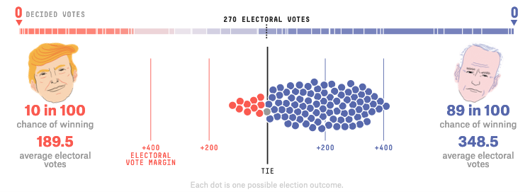
```

.tiny[Source: Adapted from [fivethirtyeight.](https://projects.fivethirtyeight.com/trump-biden-election-map/)]

.footnote[.smallest[👋 More details on the results can be found [here](https://en.wikipedia.org/wiki/2020_United_States_presidential_election).]]

---

# Population and Sample - Example

.pull-left[.smaller[In this example, we will make the .purple[following assumptions for simplicity]:

- The American population of voters is composed of 1200 individuals (616 for Biden, 561 for Trump and 23 independents).
- We can perfectly sample the population (everyone is available, no double sampling, and the sampling is random).
- People don't change their mind and they don't lie.
]]

.pull-right[

```{R, out.width = "90%", echo = F}
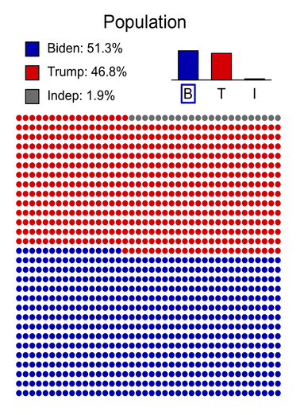
```

]

---

# Proportion Estimation

Suppose we ask $n$ voters for which candidate (Biden, Trump or independent) they intend to vote in order to estimate the proportion of voters for Biden. For that we define the .hi.purple[random variables] $X_1, ..., X_n$ where $X_i$ is defined as:

.saller[
.center[
`\(
X_i = \left\{
	\begin{array}{ll}
		1  & \mbox{if voter } i \mbox{ intends to vote for Biden}\\
		0 & \mbox{otherwise.}
	\end{array}
\right.
\)`
]
]


The random variables $X_1, ..., X_n$ are called a (random) .hi.purple[sample] and we refer to $n$ as the .hi.purple[sample size]. Let $p$ denote the (true) proportion of voters for Biden (which in this case is 51.3%), we then write


$$
\begin{align}
\color{#e64173}{\Pr \Big(} {X_i = 1} \color{#e64173}{\Big)} = p,
\end{align}
$$


where $\color{#e64173}{\Pr (} A \color{#e64173}{)}$ denotes the .pink[probability] of the .purple[event] $A$.

---

# Proportion Estimation

Using the random variables $X_1, ..., X_n$ we can define an .hi.purple[estimator] of $p$, which we often write as $\hat{p}$ and is given by


$$\hat{p} = \frac{1}{n} \sum_{i=1}^n X_i = \frac{\color{#e64173}{m}}{\color{#6A5ACD}{n}},$$


where $\color{#e64173}{m}$ denotes the number of voters in our sample in favor of Biden, and $\color{#6A5ACD}{n}$ is the sample size (as described previously).

An estimator is defined as a function of the data (i.e. $X_1, ..., X_n$), and therefore, theoretically any function of $X_1, ..., X_n$ can be an estimator. However, in this case $\hat{p}$ is the best possible estimator of $p$ <sup>.smallest[👋]</sup> and therefore it is not useful (in this case) to search for better estimators.

.footnote[.smallest[👋] More precisely, this estimator is unbiased [(more info.)](https://en.wikipedia.org/wiki/Bias_of_an_estimator) and has the smallest possible variance [(more info.)](https://en.wikipedia.org/wiki/Variance) as it attains the Cramér–Rao bound [(more info.)](https://en.wikipedia.org/wiki/Cram%C3%A9r%E2%80%93Rao_bound).]
 
---

# Population and Sample - Example

.pull-left[
.smallest[
Consider a sample of $n = 10$ voters (randomly chosen from the population) as shown here 👉. In this case, we have 5 voters for Biden and 5 for Trump. We say that $$x_1 = 1, ..., x_5 = 1, x_6 = 0, ..., x_{10} = 0$$ are .hi.purple[realizations] of the random variables $X_1, ..., X_{10}$.

We can now compute our estimator on the observed data (i.e. the realizations) and we obtain $\hat{p} = 0.5$. Therefore, .pink[our best guess] based on the available data is that 50% of the voters will vote for Biden. Unfortunately, this doesn't really help us. So let's try with a bigger sample size... say $n = 40$.
]]

.pull-right[

```{R, out.width = "90%", echo = F}
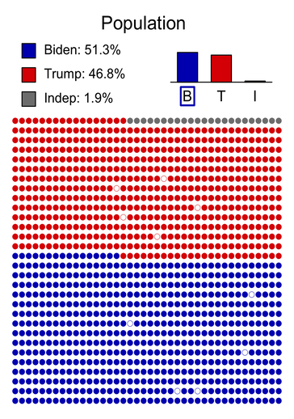
```

]

---

# Population and Sample - Example

```{R, out.width = "100%", echo = F}
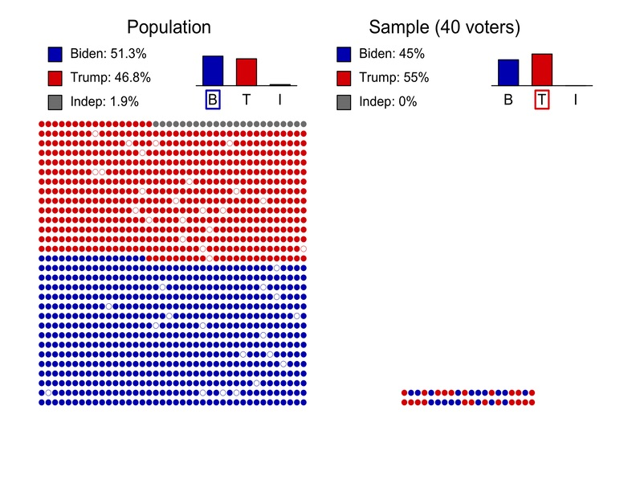
```

---

# Population and Sample - Example

.center[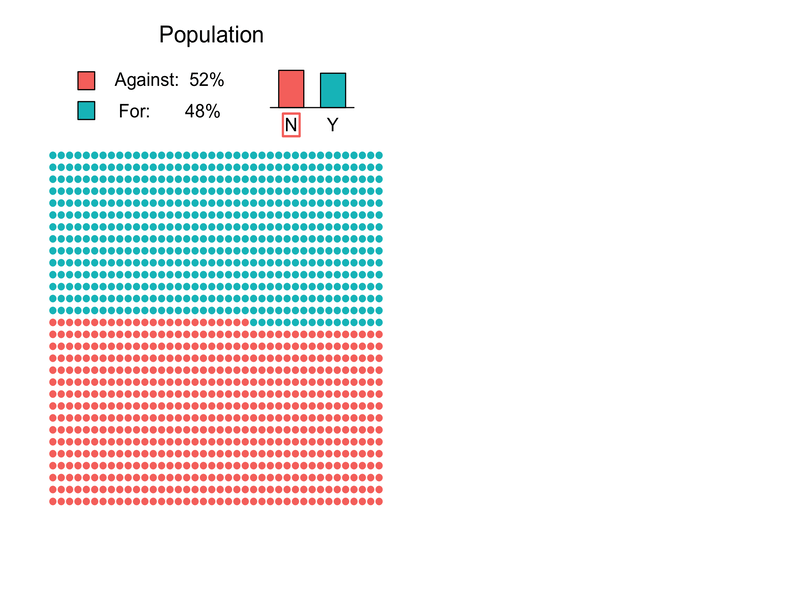]

---

# Population and Sample - Example

```{R, out.width = "100%", echo = F}
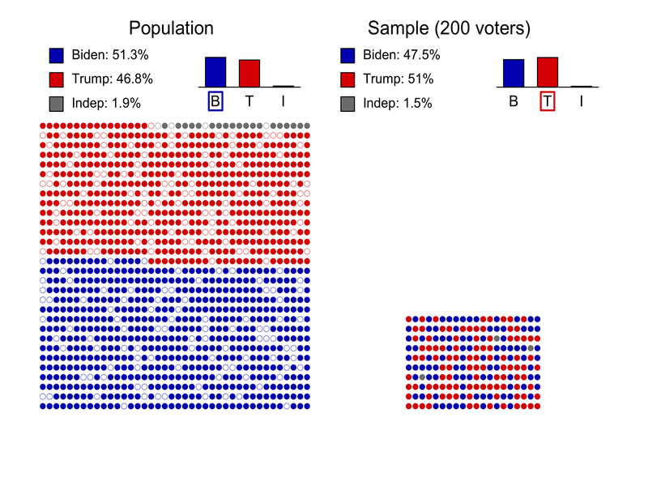
```

---

# Population and Sample - Example

```{R, out.width = "100%", echo = F}
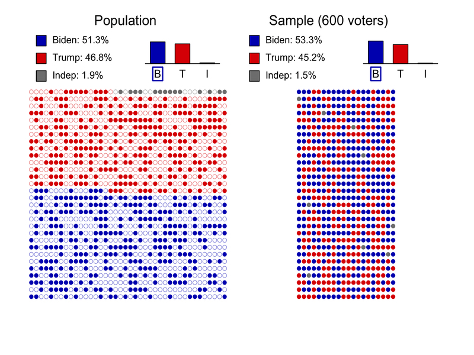
```


---

# Population and Sample - Example

- In our example, we are interested in knowing if $p$, a .pink[population-level quantity], is bigger or smaller than 50%. Unfortunately, $p$ is generally unknown as we cannot access the whole population (otherwise let's not bother with Statistics! 🤪). Therefore, we use $\hat{p}$ instead, a .purple[sample-dependent quantity].
- However, as we can see, $\hat{p}$ is .turquoise[random] in the sense that it can change depending on the collected sample (e.g. we get different answers when $n = 200$, where Trump is leading, and when $n = 600$, where Biden is leading). 
- To address this issue, we need to assess the .hi.pink[uncertainty] of $\hat{p}$ (i.e. assess how different $\hat{p}$ and $p$ can be).
- Statistics can provides us many tools allowing to determine uncertainty as well as the associated .pink[decision-making risks].

---

# How to measure uncertainty?

Uncertainty can be measured in many different ways. A common approach (in statistics) is to use .hi-purple[confidence intervals], which rely on the .hi.pink[Central Limit Theorem (CLT)] that states:

.center[.turquoise["The sampling distribution of the sample mean approaches to a normal distribution as the sample size gets larger."]]

Loosely speaking, we can translate the CLT as 

$$\bar{X} = \frac{1}{n} \sum_{i = 1}^n X_i \color{#e64173}{\overset{\cdot}{\sim}} \color{#6A5ACD}{\mathcal{N}(\mu, \sigma^2)},$$ 

where $\color{#6A5ACD}{\mathcal{N}(\mu, \sigma^2)}$ denotes a normal distribution with mean $\mu$ and variance $\sigma^2$ (typically computed using the data)<sup>.smallest[👋]</sup>. Here $\bar{X}$ denotes the sample mean and $\color{#e64173}{\overset{\cdot}{\sim}}$ represents ".pink[approximately distributed as]". 

.footnote[.smallest[👋] Check out [expected value](https://en.wikipedia.org/wiki/Expected_value) and [variance](https://en.wikipedia.org/wiki/Variance).]

---

# How to measure uncertainty?

In our example, we have 

$$\hat{p} \overset{\cdot}{\sim} \mathcal{N}\Bigg(p, \frac{p(1-p)}{n}\Bigg).$$
.pink[How to understand the practical implications of the CLT?] Informally, it means that when a measurement can be thought of as the sum (or the average) of .hi.purple[numerous] factors, its distribution tends to go to a normal distribution. For example, the height of adults can be thought of as the sum of their genetic information, diet, life style, ...

---

# Distribution of heights

```{R, out.width = "90%", echo = F}
include_graphics("pics/distribution-1.png")
```

---

# Central Limit Theorem - Example

```{R, out.width = "100%", echo = F}
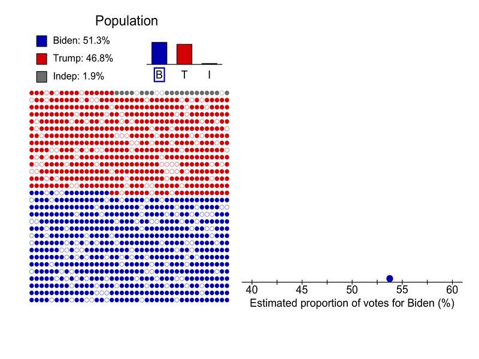
```

---

# Central Limit Theorem - Example

```{R, out.width = "100%", echo = F}
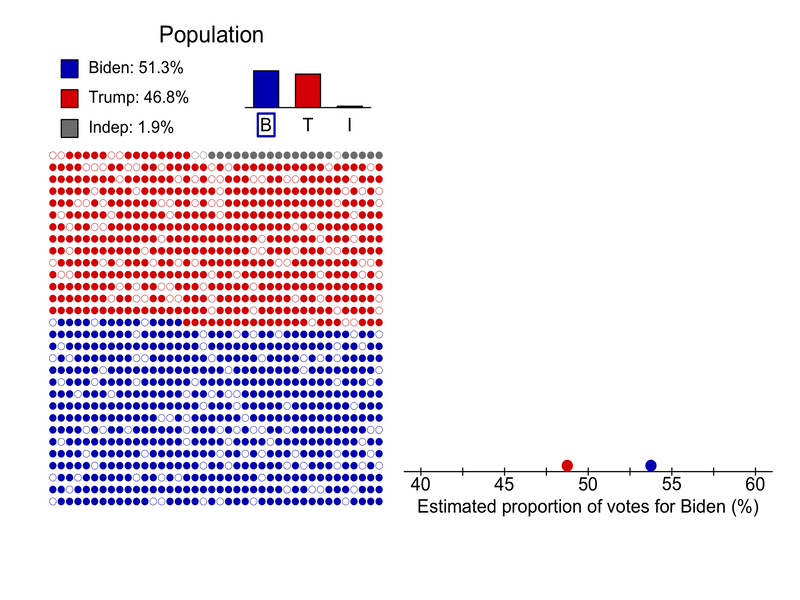
```

---

# Central Limit Theorem - Example

```{R, out.width = "100%", echo = F}
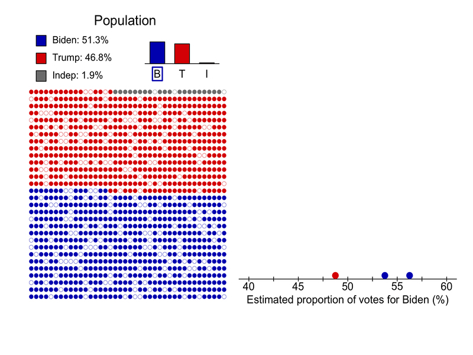
```

---

# Central Limit Theorem - Example

.center[]

---

# Central Limit Theorem - Example

```{R, out.width = "100%", echo = F}
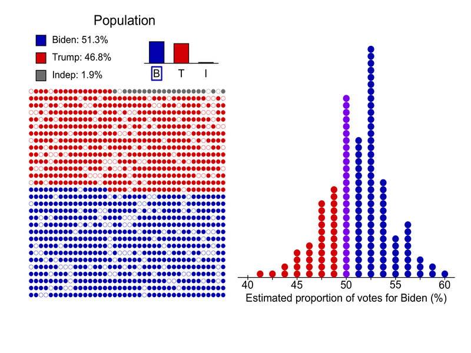
```

---

# Central Limit Theorem - Example

.center[]

---

# Central Limit Theorem - Example

```{R, out.width = "100%", echo = F}
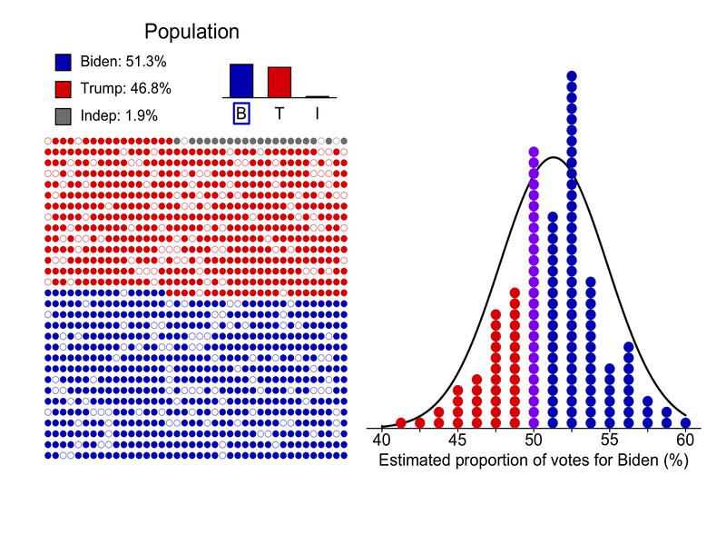
```

---

# Central Limit Theorem - Example

People have used .pink[the Galton Board] as a practical device to demonstrate the CLT, in particular that with sufficient sample size the binomial distribution approximates a normal distribution.

<div align="center">
<iframe width="684" height="381" src="https://www.youtube.com/embed/Vo9Esp1yaC8" frameborder="0" allow="accelerometer; autoplay; encrypted-media; gyroscope; picture-in-picture" allowfullscreen></iframe>
</div>

---

# Confidence Intervals

Now that we learn about CLT, how can we use it to construct .hi-purple[confidence intervals]? 

- .smaller[Confidence intervals correspond to .pink[a range of values that are likely to include the population value with a certain level of confidence]. The level of confidence is a probability expressed as a percentage (%).] 
- .smaller[In our example, we are interested in the true (population) proportion of voters in favor of Biden (51.3%). Using our sample of] $\small n=200$ .smaller[, we had] $\small m =95$ .smaller[and we can construct the following 95% confidence interval]:

.pull-left[
```{R, out.width = "90%", echo = F}
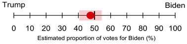
```
]

.smaller[.pull-right[
So what does it mean? 🤔 It means that with a .hi-purple[probability of 95%], the true proportion of voters for Biden (51.3% in this case) is between 40.58% and 54.42%.]
]


---

# Confidence Intervals

How is this confidence interval computed? We recall that by CLT, 

$$\hat{p} \overset{\cdot}{\sim} \mathcal{N}\Bigg(p, \frac{p(1-p)}{n}\Bigg).$$
However, as we .hi.purple[do not know] the true value of $p$ in practice, we replace it with the .hi.purple[best guess] we have, which is $\hat{p}$. We then can write

$$\hat{p} \overset{\cdot}{\sim} \mathcal{N}\Bigg(\color{#e64173}{\hat{p}}, \color{#6A5ACD}{\frac{\hat{p}(1-\hat{p})}{n}}\Bigg).$$

The $1-\alpha$ confidence interval for $p$ is then given by

$$\color{#e64173}{\hat{p}} \pm Z_{1-\alpha/2}\color{#6A5ACD}{\sqrt{\frac{\hat{p}(1-\hat{p})}{n}}}.$$

But what is $Z_{1-\alpha/2}$? 🤓

---

# Confidence Intervals

$Z_{1-\alpha/2}$ corresponds to the $1-\alpha/2$ quantile of a standard normal distribution $\mathcal{N}(0,1)$, that is, 

.center[ 
$Z_{1-\alpha/2}$ is such that $\Pr(Z \leq Z_{1-\alpha/2}) = 1-\alpha/2$ where $Z \sim \mathcal{N}(0,1)$.
]

.pull-left[

```{R, out.width = "70%", echo = F}
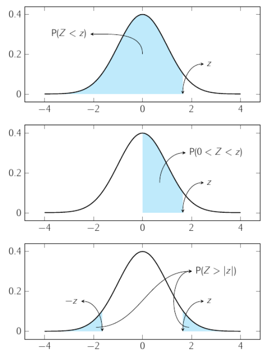
```

]

.pull-right[
- For 90% confidence interval, $Z_{0.95} \approx 1.64$. 
- .pink[For 95% confidence interval,] $\color{#e64173}{Z_{0.975} \approx 1.96}$.pink[.]
- For 99% confidence interval, $Z_{0.995} \approx 2.58$. 
]
---

# Confidence Intervals

Therefore, a confidence interval corresponds to a range of values that contains the true unknown population-level quantity we are considering with a probability of approximately $1-\alpha$ (typically 95%).

Basically, we have

$$\Pr \left(p \in \color{#e64173}{\hat{p}} \pm Z_{1-\alpha/2}\color{#6A5ACD}{\sqrt{\frac{\hat{p}(1-\hat{p})}{n}}} \right) \approx 1-\alpha.$$

⚠️ This means that a fraction of $100\times\alpha$% of confidence intervals .hi.pink[don't include] $p$. 

---

# Confidence Intervals

.center[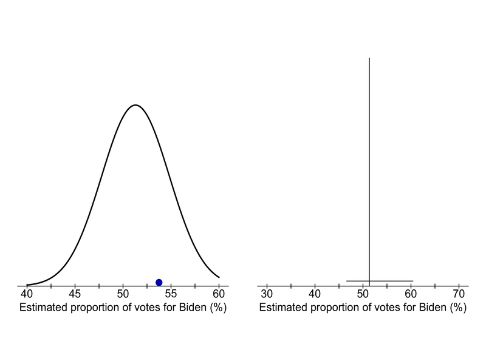]

---

# Confidence Intervals

```{R, out.width = "100%", echo = F}
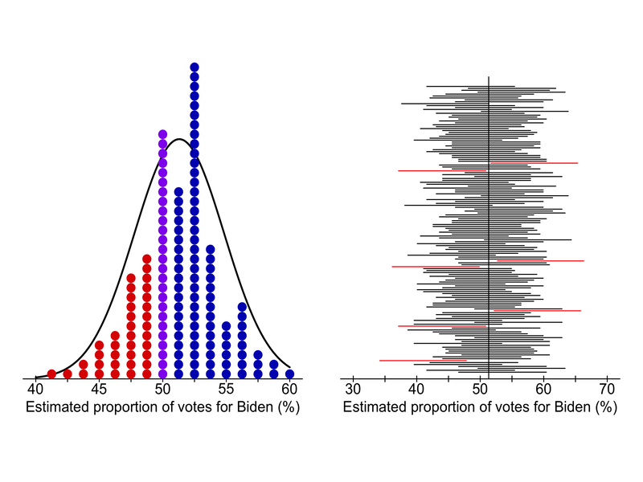
```

---

# How to compute confidence intervals

.panelset[
.panel[.panel-name[Example]
.smallest[Previously, we said that in a sample of] $\small n=200$.smallest[, we had] $\small m = 95$.smallest[. In this case, we mentioned that (40.58%, 54.42%) was a 95% confidence interval. But how are these numbers computed? We have]

$$ \small \color{#e64173}{\hat{p}} = \frac{m}{n} = \frac{95}{200} = \color{#e64173}{47.5\%}.$$
.smallest[Then, we have]

$$\small\color{#6A5ACD}{\sqrt{\frac{\hat{p}(1-\hat{p})}{n}}} \approx \color{#6A5ACD}{0.0353}.$$
.smallest[To obtain a 95% confidence interval we used] $\small Z_{1-\alpha/2} = Z_{0.975} \approx 1.96$ .smallest[ and we get]

$$\small \color{#e64173}{\hat{p}} \pm Z_{1-\alpha/2}\color{#6A5ACD}{\sqrt{\frac{\hat{p}(1-\hat{p})}{n}}} \approx \color{#e64173}{\frac{51.728}{100}} \pm 1.96 \times \color{#6A5ACD}{0.0353} = (40.58\%, 54.42\%).$$

]
.panel[.panel-name[`R` Code - 💪]
```{r}
n = 200                    # Sample size
m = 95                     # Number of boys
alpha = 0.05               # Confidence level (1-alpha)
p_hat = m/n                # Estimated proportion

# Compute CI
Z = qnorm(1 - alpha/2)
delta = sqrt(p_hat*(1 - p_hat)/n)
CI = p_hat + c(-1, +1)*Z*delta
print(paste("The estimated proportion is ", round(100*p_hat, 2), "%", sep = ""))
print(paste("A ", (1 - alpha)*100, "% confidence interval is given by (",
            round(100*CI[1], 2), "%, ", round(100*CI[2], 2), "%)", sep = ""))
```
]
]

---

# Confidence Interval with $\alpha = 20\%$

```{R, out.width = "100%", echo = F}
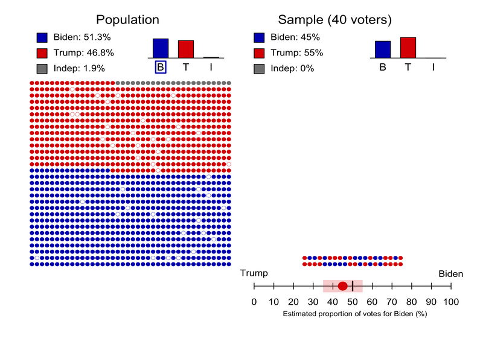
```

---

# Confidence Interval with $\alpha = 20\%$

```{R, out.width = "100%", echo = F}
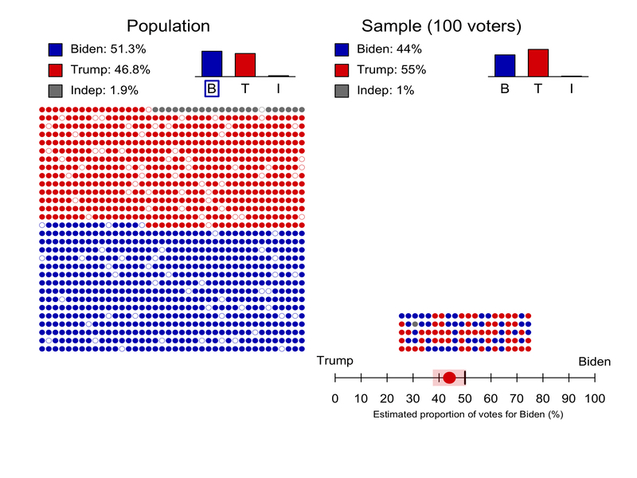
```

---

# Confidence Interval with $\alpha = 20\%$

```{R, out.width = "100%", echo = F}
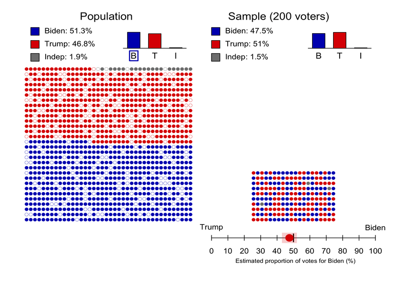
```

---

# Confidence Intervals with $\alpha = 20\%$

.center[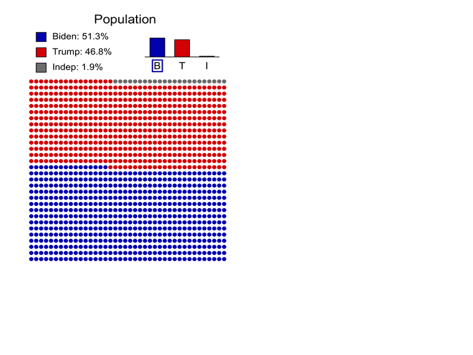]

---

# Why is 20%? Why not 5%?

.center[]

---

# What if I want to be certain? 😳

.center[]

---


# ⚠️ Take home message

- Since the data is available through sampling, it is .hi-purple[random]. .pink[Therefore, a decision or prediction can never be made with certainty!]
- The only certainty one can have is that, for example, a proportion will always be included in the interval from 0% to 100%. .hi-purple[However, this is neither informative nor useful] and it does not even depend on the data.
- There exists a trade-off between .hi-pink[risk] as measured by  $1-\alpha$ (typically 95%) the confidence level, and the .hi-pink[precision of the conclusion] as measured, for example, by the confidence interval length.
- Moreover, the larger the sample size, the more precise the conclusion, for the same confidence level.
- Therefore, .purple[every decision based on statistical methods has a risk and how much risk is acceptable depends on the context] (e.g. safety in airplanes vs which soft drink tastes better).

---

# Example: Are there more 👦 than 👧?

.panelset[
.panel[.panel-name[Problem]
.smallest[An American found 13,173 boys were born among 25,468 newborn children. Is this sample an evidence that the birth of boys may be more common than the birth of girls in the entire population?] .smallest[So, we have] $\small n = 25,468$ .smallest[and] $\small m = 13,173$. .smallest[Therefore, we have]

$$ \small \color{#e64173}{\hat{p}} = \frac{m}{n} = \frac{13173}{25468} \approx \color{#e64173}{51.728\%}.$$
.smallest[Then, we have]

$$\small\color{#6A5ACD}{\sqrt{\frac{\hat{p}(1-\hat{p})}{n}}} \approx \color{#6A5ACD}{0.003131}.$$
.smallest[To obtain a 95% confidence interval we used] $\small Z_{1-\alpha/2} = Z_{0.975} \approx 1.96$ .smallest[ and we get]

$$\small \color{#e64173}{\hat{p}} \pm Z_{1-\alpha/2}\color{#6A5ACD}{\sqrt{\frac{\hat{p}(1-\hat{p})}{n}}} \approx \color{#e64173}{\frac{51.728}{100}} \pm 1.96 \times \color{#6A5ACD}{0.003131} = (51.11\%, 52.34\%).$$

]
.panel[.panel-name[`R` Code - 💪]
```{r}
n = 25468                  # Sample size
m = 13173                  # Number of boys
alpha = 0.05               # Confidence level (1-alpha)
p_hat = m/n                # Estimated proportion

# Compute CI
Z = qnorm(1 - alpha/2)
delta = sqrt(p_hat*(1 - p_hat)/n)
CI = p_hat + c(-1, +1)*Z*delta
print(paste("The estimated proportion is ", round(100*p_hat, 2), "%", sep = ""))
print(paste("A ", (1 - alpha)*100, "% confidence interval is given by (",
            round(100*CI[1], 2), "%, ", round(100*CI[2], 2), "%)", sep = ""))
```
]

.panel[.panel-name[`R` Code - 🤖]

```{r}
n = 25468                  # Sample size
m = 13173                  # Number of boys
prop.test(x = m, n = n)
```
]
]


