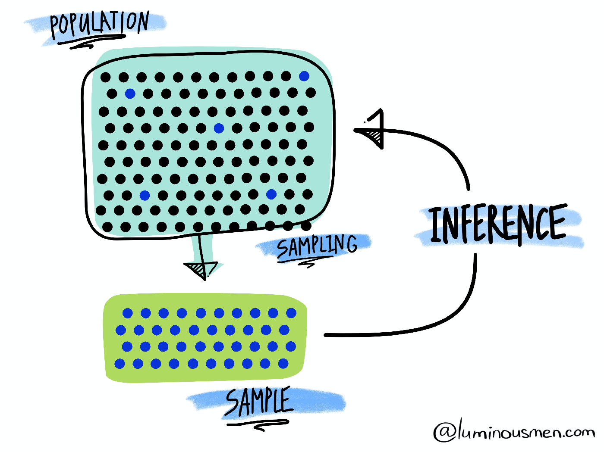

```{R, setup, include = F}
# devtools::install_github("dill/emoGG")
library(pacman)
p_load(
  broom, tidyverse,
  latex2exp, ggplot2, ggthemes, ggforce, viridis, extrafont, gridExtra,
  kableExtra, snakecase, janitor,
  data.table, dplyr, estimatr,
  lubridate, knitr, parallel,
  lfe,
  here, magrittr
)
# Define pink color
red_pink <- "#e64173"
turquoise <- "#20B2AA"
orange <- "#FFA500"
red <- "#fb6107"
blue <- "#2b59c3"
green <- "#8bb174"
grey_light <- "grey70"
grey_mid <- "grey50"
grey_dark <- "grey20"
purple <- "#6A5ACD"
slate <- "#314f4f"
# Dark slate grey: #314f4f
# Knitr options
opts_chunk$set(
  comment = "#>",
  fig.align = "center",
  fig.height = 7,
  fig.width = 10.5,
  warning = F,
  message = F
)
opts_chunk$set(dev = "svg")
options(device = function(file, width, height) {
  svg(tempfile(), width = width, height = height)
})
options(crayon.enabled = F)
options(knitr.table.format = "html")
# A blank theme for ggplot
theme_empty <- theme_bw() + theme(
  line = element_blank(),
  rect = element_blank(),
  strip.text = element_blank(),
  axis.text = element_blank(),
  plot.title = element_blank(),
  axis.title = element_blank(),
  plot.margin = structure(c(0, 0, -0.5, -1), unit = "lines", valid.unit = 3L, class = "unit"),
  legend.position = "none"
)
theme_simple <- theme_bw() + theme(
  line = element_blank(),
  panel.grid = element_blank(),
  rect = element_blank(),
  strip.text = element_blank(),
  axis.text.x = element_text(size = 18, family = "STIXGeneral"),
  axis.text.y = element_blank(),
  axis.ticks = element_blank(),
  plot.title = element_blank(),
  axis.title = element_blank(),
  # plot.margin = structure(c(0, 0, -1, -1), unit = "lines", valid.unit = 3L, class = "unit"),
  legend.position = "none"
)
theme_axes_math <- theme_void() + theme(
  text = element_text(family = "MathJax_Math"),
  axis.title = element_text(size = 22),
  axis.title.x = element_text(hjust = .95, margin = margin(0.15, 0, 0, 0, unit = "lines")),
  axis.title.y = element_text(vjust = .95, margin = margin(0, 0.15, 0, 0, unit = "lines")),
  axis.line = element_line(
    color = "grey70",
    size = 0.25,
    arrow = arrow(angle = 30, length = unit(0.15, "inches")
  )),
  plot.margin = structure(c(1, 0, 1, 0), unit = "lines", valid.unit = 3L, class = "unit"),
  legend.position = "none"
)
theme_axes_serif <- theme_void() + theme(
  text = element_text(family = "MathJax_Main"),
  axis.title = element_text(size = 22),
  axis.title.x = element_text(hjust = .95, margin = margin(0.15, 0, 0, 0, unit = "lines")),
  axis.title.y = element_text(vjust = .95, margin = margin(0, 0.15, 0, 0, unit = "lines")),
  axis.line = element_line(
    color = "grey70",
    size = 0.25,
    arrow = arrow(angle = 30, length = unit(0.15, "inches")
  )),
  plot.margin = structure(c(1, 0, 1, 0), unit = "lines", valid.unit = 3L, class = "unit"),
  legend.position = "none"
)
theme_axes <- theme_void() + theme(
  text = element_text(family = "Fira Sans Book"),
  axis.title = element_text(size = 18),
  axis.title.x = element_text(hjust = .95, margin = margin(0.15, 0, 0, 0, unit = "lines")),
  axis.title.y = element_text(vjust = .95, margin = margin(0, 0.15, 0, 0, unit = "lines")),
  axis.line = element_line(
    color = grey_light,
    size = 0.25,
    arrow = arrow(angle = 30, length = unit(0.15, "inches")
  )),
  plot.margin = structure(c(1, 0, 1, 0), unit = "lines", valid.unit = 3L, class = "unit"),
  legend.position = "none"
)
theme_set(theme_gray(base_size = 20))
# Column names for regression results
reg_columns <- c("Term", "Est.", "S.E.", "t stat.", "p-Value")
# Function for formatting p values
format_pvi <- function(pv) {
  return(ifelse(
    pv < 0.0001,
    "<0.0001",
    round(pv, 4) %>% format(scientific = F)
  ))
}
format_pv <- function(pvs) lapply(X = pvs, FUN = format_pvi) %>% unlist()
# Tidy regression results table
tidy_table <- function(x, terms, highlight_row = 1, highlight_color = "black", highlight_bold = T, digits = c(NA, 3, 3, 2, 5), title = NULL) {
  x %>%
    tidy() %>%
    select(1:5) %>%
    mutate(
      term = terms,
      p.value = p.value %>% format_pv()
    ) %>%
    kable(
      col.names = reg_columns,
      escape = F,
      digits = digits,
      caption = title
    ) %>%
    kable_styling(font_size = 20) %>%
    row_spec(1:nrow(tidy(x)), background = "white") %>%
    row_spec(highlight_row, bold = highlight_bold, color = highlight_color)
}
```

```{css, echo = F, eval = F}
@media print {
  .has-continuation {
    display: block !important;
  }
}
```

# What is statistics?

.pull-left[
.smaller[.hi-pink[Statistics] is a science that uses mathematics and computer science to deal with the collection, analysis, interpretation, and presentation of masses of numerical data. Informally, it is the .pink[science of learning from data]. 🧐]
```{R, stat, out.width = "90%", echo = F}
include_graphics("pics/stat.jpeg")
```
.tiny[Source: [luminousmen](luminousmen.com)]
]

.pull-right[
.smaller[.hi-purple[Statistics] is a crucial part of our life. However, .purple[statistical methods are often consciously (or not) misused] (but how? 🤔). This can lead to contradictory studies and conclusions (as seen during the current COVID-19 pandemic).]

```{R, torture, out.width = "80%", echo = F}
include_graphics("pics/data-torture.png")
```

.tiny[Source: [Atoz Markets](https://atozmarkets.com/news/untold-reality-of-p-hacking-in-finance/)]

]

---

# What is statistical literacy?

(TO KEEP? MAYBE CHANGE statistical literacy to stat and adapt... MINGMING WHAT DO YOU THINK?)

.smallest[.hi-pink[Statistical Literacy] can be defined as follows:]
- .smallest[The ability to .pink[understand data], or arguments that use data.]
- .smallest[Being able to apply .pink[critical thinking] about numbers and about .pink[statistics used as evidence in arguments].]
- .smallest[Understanding how statistical associations are used to assess causal connections.]  

.pull-left[
```{R, correlation, out.width = "100%", echo = F}
include_graphics("pics/correlation.png")
```
]

.pull-right[
.tiny[Source: [xkcd](xkcd.com/552)]

👋 .smallest[If you want to know more about these comic strips take a look [here](https://www.explainxkcd.com/wiki/index.php/552:_Correlation).]
]

.smallest[.hi-purple[Statistical literacy is now becoming an essential skill]. It is, for example, needed by .purple[anyone who tries to learn new information from data]. .turquoise[Scientists also need to develop statistical literacy so that they can produce both rigorous and reproducible research.]]

---

# (Mis)Understanding statistical results

(KEEP?)

```{R, correaltion, out.width = "65%", echo = F}
include_graphics("pics/conditional_risk.png")
```

.tiny[Source: [xkcd](xkcd.com/795)]

👋 .smaller[If you want to know more about these comic strips take a look [here](https://www.explainxkcd.com/wiki/index.php/795:_Conditional_Risk).]

---

# Simpsons Paradox

TO DO (mingming?) Should that stat can be tricky...

---

# How can statistics be useful?

(MAYBE KEEP THIS SLIDE BUT ADAPT)

As mentioned previously, statistics is the .pink[science of learning from data]. It can be used (among others) to:
1. .purple[Visualize data] (e.g. propagation of COVID-19 in different countries).
2. .purple[Understand and interpret data] (e.g. main causes of cancer). 
3. .purple[Make predictions] (e.g. predicting unemployment or risk indices).
4. .hi-pink[Assess the validity of a hypothesis].

In this class, we will focus on the last point:
''.pink[*how to assess the validity of a hypothesis using statistics?*]''. More precisely, we will discuss how statistical methods can be used to evaluate claims (hypotheses) such as:

1. Coffee consumption increases blood pressure (really 🙄 ☕?).
2. Republican politicians are bad/good for the American Economy.
3. A glass of red wine is as good as an hour at the gym (🍷 🏃 😆).

---

# How does it work?

(MAYBE KEEP THIS SLIDE BUT ADAPT)

- Statistical methods are based on several fundamental concepts, the most central of which is to consider the information available (in the form of data) resulting from a .hi-pink[random process]. 🙉
- As such, the data represent a .hi-turquoise[random sample] of a totally or conceptually accessible .hi-turquoise[population].

```{R, sampling, out.width = "50%", echo = F}

```

.tiny[Source: [luminousmen](luminousmen.com)]

---

# How does it work?

(MAYBE KEEP THIS SLIDE BUT ADAPT)

- Statistics allows to determine the .hi-pink[decision-making risks] (in the form of probabilities) associated with learning (decisions) based on the analysis of data extracted from samples. .slate[This allows to evaluate the validity of a claim] (such as the ones we discussed previously). 
- .purple[Understanding and knowing how to interpret statistical analyses is therefore becoming an increasingly vital skill].
- In some sense, .hi-pink[statistics plays a crucial role in our life] as new discoveries (obtained using statistical methods) directly impact us<sup>.smallest[👋]</sup>.
- However, understanding statistical results is not intuitive. There exist many pitfalls such as .purple[p-hacking] or .purple[HARKing] (e.g. why are there so many contradictory studies? Is Hydroxychloroquine working or not?).

.footnote[.smallest[👋] This  is essentially true in the area of .hi-purple[Big Data] where the discovery of patterns and/or signals hidden in massive amounts of data is increasingly becoming one of the major challenges faced by modern scientific research.]

