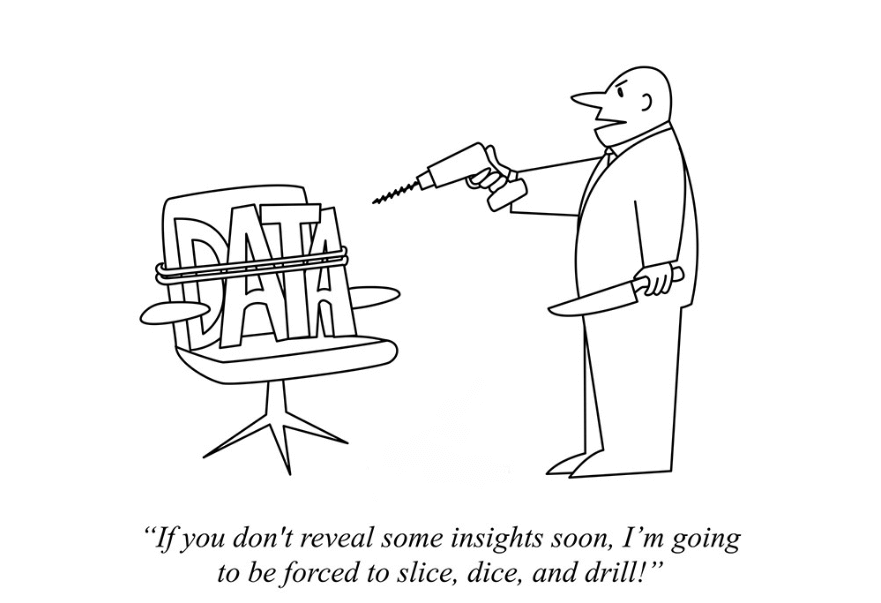
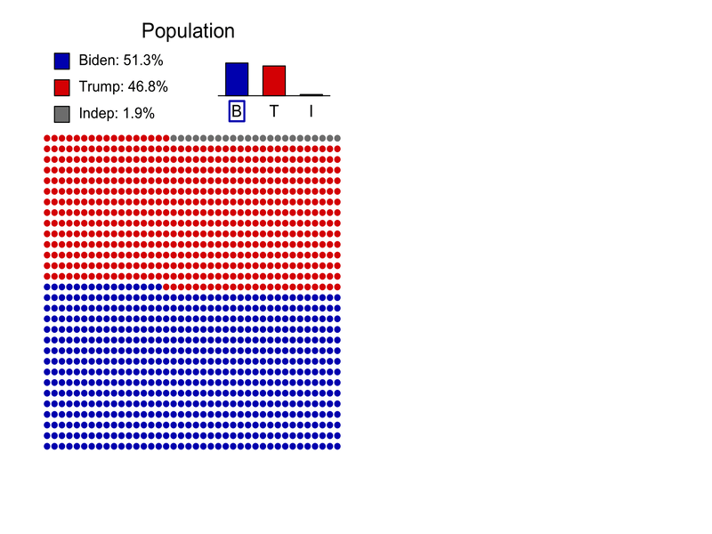

```{R, setup, include = F}
# devtools::install_github("dill/emoGG")
library(pacman)
p_load(
  broom, tidyverse,
  latex2exp, ggplot2, ggthemes, ggforce, viridis, extrafont, gridExtra,
  kableExtra, snakecase, janitor,
  data.table, dplyr, estimatr,
  lubridate, knitr, parallel,
  lfe,
  here, magrittr
)
# Define pink color
red_pink <- "#e64173"
turquoise <- "#20B2AA"
orange <- "#FFA500"
red <- "#fb6107"
blue <- "#2b59c3"
green <- "#8bb174"
grey_light <- "grey70"
grey_mid <- "grey50"
grey_dark <- "grey20"
purple <- "#6A5ACD"
slate <- "#314f4f"
# Dark slate grey: #314f4f
# Knitr options
opts_chunk$set(
  comment = "#>",
  fig.align = "center",
  fig.height = 7,
  fig.width = 10.5,
  warning = F,
  message = F
)
opts_chunk$set(dev = "svg")
options(device = function(file, width, height) {
  svg(tempfile(), width = width, height = height)
})
options(crayon.enabled = F)
options(knitr.table.format = "html")
# A blank theme for ggplot
theme_empty <- theme_bw() + theme(
  line = element_blank(),
  rect = element_blank(),
  strip.text = element_blank(),
  axis.text = element_blank(),
  plot.title = element_blank(),
  axis.title = element_blank(),
  plot.margin = structure(c(0, 0, -0.5, -1), unit = "lines", valid.unit = 3L, class = "unit"),
  legend.position = "none"
)
theme_simple <- theme_bw() + theme(
  line = element_blank(),
  panel.grid = element_blank(),
  rect = element_blank(),
  strip.text = element_blank(),
  axis.text.x = element_text(size = 18, family = "STIXGeneral"),
  axis.text.y = element_blank(),
  axis.ticks = element_blank(),
  plot.title = element_blank(),
  axis.title = element_blank(),
  # plot.margin = structure(c(0, 0, -1, -1), unit = "lines", valid.unit = 3L, class = "unit"),
  legend.position = "none"
)
theme_axes_math <- theme_void() + theme(
  text = element_text(family = "MathJax_Math"),
  axis.title = element_text(size = 22),
  axis.title.x = element_text(hjust = .95, margin = margin(0.15, 0, 0, 0, unit = "lines")),
  axis.title.y = element_text(vjust = .95, margin = margin(0, 0.15, 0, 0, unit = "lines")),
  axis.line = element_line(
    color = "grey70",
    size = 0.25,
    arrow = arrow(angle = 30, length = unit(0.15, "inches")
  )),
  plot.margin = structure(c(1, 0, 1, 0), unit = "lines", valid.unit = 3L, class = "unit"),
  legend.position = "none"
)
theme_axes_serif <- theme_void() + theme(
  text = element_text(family = "MathJax_Main"),
  axis.title = element_text(size = 22),
  axis.title.x = element_text(hjust = .95, margin = margin(0.15, 0, 0, 0, unit = "lines")),
  axis.title.y = element_text(vjust = .95, margin = margin(0, 0.15, 0, 0, unit = "lines")),
  axis.line = element_line(
    color = "grey70",
    size = 0.25,
    arrow = arrow(angle = 30, length = unit(0.15, "inches")
  )),
  plot.margin = structure(c(1, 0, 1, 0), unit = "lines", valid.unit = 3L, class = "unit"),
  legend.position = "none"
)
theme_axes <- theme_void() + theme(
  text = element_text(family = "Fira Sans Book"),
  axis.title = element_text(size = 18),
  axis.title.x = element_text(hjust = .95, margin = margin(0.15, 0, 0, 0, unit = "lines")),
  axis.title.y = element_text(vjust = .95, margin = margin(0, 0.15, 0, 0, unit = "lines")),
  axis.line = element_line(
    color = grey_light,
    size = 0.25,
    arrow = arrow(angle = 30, length = unit(0.15, "inches")
  )),
  plot.margin = structure(c(1, 0, 1, 0), unit = "lines", valid.unit = 3L, class = "unit"),
  legend.position = "none"
)
theme_set(theme_gray(base_size = 20))
# Column names for regression results
reg_columns <- c("Term", "Est.", "S.E.", "t stat.", "p-Value")
# Function for formatting p values
format_pvi <- function(pv) {
  return(ifelse(
    pv < 0.0001,
    "<0.0001",
    round(pv, 4) %>% format(scientific = F)
  ))
}
format_pv <- function(pvs) lapply(X = pvs, FUN = format_pvi) %>% unlist()
# Tidy regression results table
tidy_table <- function(x, terms, highlight_row = 1, highlight_color = "black", highlight_bold = T, digits = c(NA, 3, 3, 2, 5), title = NULL) {
  x %>%
    tidy() %>%
    select(1:5) %>%
    mutate(
      term = terms,
      p.value = p.value %>% format_pv()
    ) %>%
    kable(
      col.names = reg_columns,
      escape = F,
      digits = digits,
      caption = title
    ) %>%
    kable_styling(font_size = 20) %>%
    row_spec(1:nrow(tidy(x)), background = "white") %>%
    row_spec(highlight_row, bold = highlight_bold, color = highlight_color)
}
```

```{css, echo = F, eval = F}
@media print {
  .has-continuation {
    display: block !important;
  }
}
```


# Introduction

Welcome to the class "Introduction to Statistics"! We hope that you all will enjoy this class!

Throughout this class, we will use a platform called .hi-pink[Piazza] for the share of all the teaching materials and Q&A. 

```{R, out.width = "40%", echo = F}
include_graphics("pics/piazza.png")
```

- Signup Link: [https://piazza.com/configure-classes/winter2020/sisu](https://piazza.com/configure-classes/winter2020/sisu)
- Access Code: .purple[statisfun]

---

# Introduction 

In this class, we will also use some statistical softwares .hi-pink[R] and .hi-pink[R Studio], which you can download with the following: 

- Latest version of R: [https://cran.r-project.org/](https://cran.r-project.org/)
- Latest version of R Studio: [https://www.rstudio.com/](https://www.rstudio.com/)

.hi-purple[Note:] You cannot use RStudio without having installed R on your computer.

---

# Introduction

```{R, out.width = "60%", echo = F}
include_graphics("pics/r_first_then.png")
```

---

# What is statistics?

.pull-left[
.smaller[.hi-pink[Statistics] is a science that uses mathematics and computer science to deal with the collection, analysis, interpretation, and presentation of masses of numerical data. Informally, it is the .pink[science of learning from data].]
```{R, stat, out.width = "90%", echo = F}
include_graphics("pics/stat.jpeg")
```
.tiny[Source: [luminousmen](luminousmen.com)]
]

.pull-right[
.smaller[.hi-purple[Statistics] is a crucial part of our life. However, .purple[statistical methods are often consciously (or not) misused]. This can lead to contradictory studies and conclusions (as seen during the current COVID-19 pandemic).]

```{R, torture, out.width = "80%", echo = F}

```

.tiny[Source: [Atoz Markets](https://atozmarkets.com/news/untold-reality-of-p-hacking-in-finance/)]
]

---

# How can statistics be useful?

.smallest[As mentioned previously, statistics is the .pink[science of learning from data]. It can be used (among others) to

1. .purple[Visualize data] (e.g. propagation of COVID-19 in different countries).
2. .purple[Understand and interpret data] (e.g. main causes of cancer). 
3. .purple[Assess the validity of a hypothesis].
4. .purple[Make predictions] (e.g. predicting unemployment or risk indices).]

.smallest[Learning statistics allows us to ]

1. .smallest[.pink[Understand data], or arguments that use data.]
2. .smallest[Be able to apply .pink[critical thinking] about numbers and about .pink[statistics used as evidence in arguments].]
3. .smallest[Understand how statistical associations are used to .pink[evaluate claims (hypotheses)] and .pink[assess causal connections.] (e.g. Coffee consumption increases blood pressure?)]  

.smallest[.purple[To summarize, understanding and knowing how to interpret statistical analyses is therefore becoming an increasingly vital skill.]]

---

# Simpson's Paradox

.pull-left[.smallest[.pink[Statistical analysis can be tricky.] Here we give an example of a study of gender bias among graduate school admissions to University of California, Berkeley, for the fall of 1973.]

```{R, out.width = "100%", echo = F}
include_graphics("pics/berkeley1.png")
```

```{R, out.width = "100%", echo = F}

```

]

.pull-right[

1. .smallest[The table of total admission shows that men applying were more likely than women to be admitted, and the difference was so large (9%) that it was unlikely to be due to chance.]
2. .smallest[However, when we look into the admission data by department basis, it turned out that most of the departments actually had a slightly higher success rate for female applicants than for male applicants.]
3. .smallest[This phenomenon is known as .hi-purple[Simpson's Paradox]. ]
]


---

# How does it work?

.smallest[
- Statistical methods are based on several fundamental concepts, the most central of which is to consider the information available (in the form of data) resulting from a .hi-pink[random process]. 🙉
- As such, the data represent a .hi-turquoise[random sample] of a totally or conceptually accessible .hi-turquoise[population].
- We can then provide .hi-purple[statistical inference] which infers properties of a population based on the observed sample. This includes deriving estimates and testing hypotheses.
- However, understanding statistical results is not intuitive. There exist many pitfalls such as .purple[p-hacking] or .purple[HARKing]. ]

```{R, out.width = "30%", echo = F}
include_graphics("pics/sampling.png")
```
.tiny[Source: [luminousmen](luminousmen.com)]

---

# How does it work?

(TO REMOVE)

- Statistics allows to determine the .hi-pink[decision-making risks] (in the form of probabilities) associated with learning (decisions) based on the analysis of data extracted from samples. .slate[This allows to evaluate the validity of a claim] (such as the ones we discussed previously). 
- .purple[Understanding and knowing how to interpret statistical analyses is therefore becoming an increasingly vital skill].
- In some sense, .hi-pink[statistics plays a crucial role in our life] as new discoveries (obtained using statistical methods) directly impact us<sup>.smallest[👋]</sup>.
- However, understanding statistical results is not intuitive. There exist many pitfalls such as .purple[p-hacking] or .purple[HARKing] (e.g. why are there so many contradictory studies? Is Hydroxychloroquine working or not?).

.footnote[.smallest[👋] This is essentially true in the area of .hi-purple[Big Data] where the discovery of patterns and/or signals hidden in massive amounts of data is increasingly becoming one of the major challenges faced by modern scientific research.]

---

# Outline

In this class, we plan to cover the following topics: 

- Introduction to .pink[statistical inference] (concepts of random variables, confidence interval and p-values).
- Introduction to the .purple[statistical software R].
- .pink[Tests for comparing the mean of two groups] (descriptive analysis, t-test, rank-based methods).
- .purple[Tests for comparing the mean of multiple groups] (descriptive analysis, ANOVA and non-parametric counterpart, discussion on multiple testing).
- Introduction to .pink[regression] (correlation vs causality, descriptive analysis, linear regression and going beyond linear regression).
- .purple[Pitfalls] for statistical analysis and remedies (p-hacking/HARKing and how to avoid it, replicability crisis).

---

# Population and Sample - Example

.smallest[To fix ideas we will consider a simple example. The 2020 United States presidential election was the 59th quadrennial presidential election, held on November 3, 2020. According to the latest estimates, .hi.pink[Biden's team received 51.3% of the votes while Trump's received 46.8%] <sup>.smallest[👋]</sup>. Naturally, the result of American elections is not determined by the popular vote but suppose that we were interested in collecting data .hi-purple[before the vote] to assess if Biden's team will receive more than 50% of the votes].

```{R, out.width = "80%", echo = F}
include_graphics("pics/trump2.png")
```

.tiny[Source: Adapted from [fivethirtyeight.](https://projects.fivethirtyeight.com/trump-biden-election-map/)]

.footnote[.smallest[👋 More details on the results can be found [here](https://en.wikipedia.org/wiki/2020_United_States_presidential_election).]]

---

# Population and Sample - Example

.pull-left[.smaller[In this example, we will make the .purple[following assumptions for simplicity]:

- The American population of voters is composed of 1200 individuals (616 for Biden, 561 for Trump and 23 independents).
- We can perfectly sample the population (everyone is available, no double sampling, and the sampling is random).
- People don't change their mind and they don't lie.
]]

.pull-right[

```{R, out.width = "90%", echo = F}
include_graphics("pics/pop.jpg")
```

]

---

# Proportion Estimation

Suppose we ask $n$ voters for which candidate (Biden, Trump or independent) they intend to vote in order to estimate the proportion of voters for Biden. For tWine the .hi.purple[random variables] $X_1, ..., X_n$ where $X_i$ is defined as:

.saller[
.center[
`\(
X_i = \left\{
	\begin{array}{ll}
		1  & \mbox{if voter } i \mbox{ intends to vote for Biden}\\
		0 & \mbox{otherwise.}
	\end{array}
\right.
\)`
]
]


The random variables $X_1, ..., X_n$ are called a (random) .hi.purple[sample] and we refer to $n$ as the .hi.purple[sample size]. Let denote the (true) proportion of voters for Biden (which in this case is 51.3%), we then write


$$
\begin{align}
\color{#e64173}{\Pr \Big(} {X_i = 1} \color{#e64173}{\Big)} = p,
\end{align}
$$


where $\color{#e64173}{\Pr (} A \color{#e64173}{)}$ denote the .pink[probability] of the .purple[event] $A$.

---

# Proportion Estimation

Using the random variables $X_1, ..., X_n$ we can define an .hi.purple[estimator] of $p$, which we often write as $\hat{p}$ and is given by


$$\hat{p} = \frac{1}{n} \sum_{i=1}^n X_i = \frac{\color{#e64173}{m}}{\color{#6A5ACD}{n}},$$


where $\color{#e64173}{m}$ denotes the number of voters in our sample in favor of Biden, and $\color{#6A5ACD}{n}$ is the sample size (as described previously).

An estimator is defined as a function of the data (i.e. $X_1, ..., X_n$), and therefore, theoretically any function of $X_1, ..., X_n$ can be an estimator. However, in this case $\hat{p}$ is the best possible estimator of $p$ <sup>.smallest[👋]</sup> and therefore it is not useful (in this case) to search for better estimators.

.footnote[.smallest[👋] More precisely, this estimator is unbiased [(more info.)](https://en.wikipedia.org/wiki/Bias_of_an_estimator) and has the smallest possible variance [(more info.)](https://en.wikipedia.org/wiki/Variance) as it attains the Cramér–Rao bound [(more info.)](https://en.wikipedia.org/wiki/Cram%C3%A9r%E2%80%93Rao_bound).]
 
---

# Population and Sample - Example

.pull-left[
.smallest[
Consider a sample of $n = 10$ voters (randomly chosen from the population) as shown here 👉. In this case, we have 5 voters for Biden and 5 for Trump. We say that $$x_1 = 1, ..., x_5 = 1, x_6 = 0, ..., x_{10} = 0$$ are .hi.purple[realizations] of the random variables $X_1, ..., X_{10}$.

We can now compute our estimator on the observed data (i.e. the realizations) and we obtain $\hat{p} = 0.5$. Therefore, .pink[our best guess] based on the available data is that 50% of the voters will vote for Biden. Unfortunately, this doesn't really help us. So let's try with a bigger sample size... say $n = 40$.
]]

.pull-right[

```{R, out.width = "90%", echo = F}
include_graphics("pics/sample1.jpg")
```

]

---

# Population and Sample - Example

```{R, out.width = "100%", echo = F}
include_graphics("pics/sample3.jpg")
```

---

# Population and Sample - Example

.center[]

---

# Population and Sample - Example

```{R, out.width = "100%", echo = F}
include_graphics("pics/sample_n2.jpg")
```

---

# Population and Sample - Example

```{R, out.width = "100%", echo = F}

```


---

# Population and Sample - Example

- In our example, we are interested in knowing if $p$, a .pink[population-level quantity] is bigger or smaller than 50%. Unfortunately, $p$ is generally unknown as we cannot access the whole population. Therefore, we use $\hat{p}$ instead, a .purple[sample-dependent quantity].
- However, as we can see, $\hat{p}$ is .hi.turquoise[random] in the sense that it can change depending on the collected sample (e.g. we get different answers when $n = 200$ and when $n = 600$). 
- To address this issue, we need to assess the .hi.pink[uncertainty] of $\hat{p}$ (i.e. assess how different $\hat{p}$ and $p$ can be).

---

# How to measure uncertainty?

.pink[Uncertainty can be measured in many different ways]. A common approach (in statistics) is to use .hi-purple[confidence intervals], which rely on the Central Limit Theorem (CLT) that states:

.center[.turquoise["The sampling distribution of the sample mean approaches to a normal distribution as the sample size gets larger."]]

Loosely speaking, we can translate the CLT as $$\bar{X} \overset{\cdot}{\sim} N(\mu, \sigma^2),$$ with some $\mu$ and $\sigma^2$<sup>.smallest[👋]</sup>. Here $\bar{X}$ denotes the sample mean and $\overset{\cdot}{\sim}$ represents "approximately distributed as". In our example, we have $$\hat{p} \overset{\cdot}{\sim} N(p, \frac{p(1-p)}{n})$$. 

.footnote[.smallest[👋] More precisely, $\mu$ is the expected value (also called expectation) of $\hat{p}$ and $\sigma^2$ is the variance of $\hat{p}$. Check out [expected value](https://en.wikipedia.org/wiki/Expected_value) and [variance](https://en.wikipedia.org/wiki/Variance).]


---

# Should we measure uncertainty?

(mingming: to improve)

- In our example, we are interested in knowing if $p$ is bigger or smaller than 50% but, unfortunately, $p$ is unknown (in general) and we use $\hat{p}$ instead.
- Our estimator $\hat{p}$ is not perfect and it is different from $p$. Also, we see that depending on $n$ we can get different answers (see $n = 200$ and $n = 600$).
- To address this issue we can try to assess the uncertainty of $\hat{p}$ (i.e. assess how different $\hat{p}$ and $p$ can be).
- .pink[Uncertainty can be measured in many different ways]. A common approach (in statistics) is to use .hi-purple[confidence intervals]. 
- In order to understand how such intervals can obtained, we will first present the .hi.purple[Central Limit Theorem], which states that: .turquoise[the sampling distribution of the sample means approaches a normal distribution as the sample size gets larger]. So, what does this means? 😟
