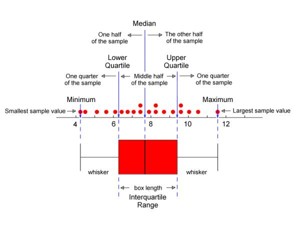
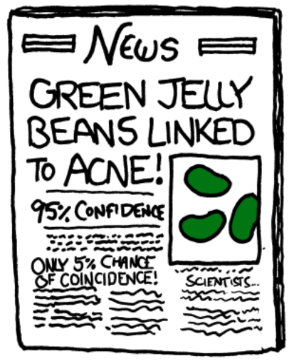

```{R, setup, include = F}
# devtools::install_github("dill/emoGG")
library(pacman)
p_load(
  broom, tidyverse,
  latex2exp, ggplot2, ggthemes, ggforce, viridis, extrafont, gridExtra,
  kableExtra, snakecase, janitor,
  data.table, dplyr, estimatr,
  lubridate, knitr, parallel,
  lfe,
  here, magrittr
)
# Define pink color
red_pink <- "#e64173"
turquoise <- "#20B2AA"
orange <- "#FFA500"
red <- "#fb6107"
blue <- "#2b59c3"
green <- "#8bb174"
grey_light <- "grey70"
grey_mid <- "grey50"
grey_dark <- "grey20"
purple <- "#6A5ACD"
slate <- "#314f4f"
# Dark slate grey: #314f4f
# Knitr options
opts_chunk$set(
  comment = "#>",
  fig.align = "center",
  fig.height = 7,
  fig.width = 10.5,
  warning = F,
  message = F
)
opts_chunk$set(dev = "svg")
options(device = function(file, width, height) {
  svg(tempfile(), width = width, height = height)
})
options(crayon.enabled = F)
options(knitr.table.format = "html")
# A blank theme for ggplot
theme_empty <- theme_bw() + theme(
  line = element_blank(),
  rect = element_blank(),
  strip.text = element_blank(),
  axis.text = element_blank(),
  plot.title = element_blank(),
  axis.title = element_blank(),
  plot.margin = structure(c(0, 0, -0.5, -1), unit = "lines", valid.unit = 3L, class = "unit"),
  legend.position = "none"
)
theme_simple <- theme_bw() + theme(
  line = element_blank(),
  panel.grid = element_blank(),
  rect = element_blank(),
  strip.text = element_blank(),
  axis.text.x = element_text(size = 18, family = "STIXGeneral"),
  axis.text.y = element_blank(),
  axis.ticks = element_blank(),
  plot.title = element_blank(),
  axis.title = element_blank(),
  # plot.margin = structure(c(0, 0, -1, -1), unit = "lines", valid.unit = 3L, class = "unit"),
  legend.position = "none"
)
theme_axes_math <- theme_void() + theme(
  text = element_text(family = "MathJax_Math"),
  axis.title = element_text(size = 22),
  axis.title.x = element_text(hjust = .95, margin = margin(0.15, 0, 0, 0, unit = "lines")),
  axis.title.y = element_text(vjust = .95, margin = margin(0, 0.15, 0, 0, unit = "lines")),
  axis.line = element_line(
    color = "grey70",
    size = 0.25,
    arrow = arrow(angle = 30, length = unit(0.15, "inches")
  )),
  plot.margin = structure(c(1, 0, 1, 0), unit = "lines", valid.unit = 3L, class = "unit"),
  legend.position = "none"
)
theme_axes_serif <- theme_void() + theme(
  text = element_text(family = "MathJax_Main"),
  axis.title = element_text(size = 22),
  axis.title.x = element_text(hjust = .95, margin = margin(0.15, 0, 0, 0, unit = "lines")),
  axis.title.y = element_text(vjust = .95, margin = margin(0, 0.15, 0, 0, unit = "lines")),
  axis.line = element_line(
    color = "grey70",
    size = 0.25,
    arrow = arrow(angle = 30, length = unit(0.15, "inches")
  )),
  plot.margin = structure(c(1, 0, 1, 0), unit = "lines", valid.unit = 3L, class = "unit"),
  legend.position = "none"
)
theme_axes <- theme_void() + theme(
  text = element_text(family = "Fira Sans Book"),
  axis.title = element_text(size = 18),
  axis.title.x = element_text(hjust = .95, margin = margin(0.15, 0, 0, 0, unit = "lines")),
  axis.title.y = element_text(vjust = .95, margin = margin(0, 0.15, 0, 0, unit = "lines")),
  axis.line = element_line(
    color = grey_light,
    size = 0.25,
    arrow = arrow(angle = 30, length = unit(0.15, "inches")
  )),
  plot.margin = structure(c(1, 0, 1, 0), unit = "lines", valid.unit = 3L, class = "unit"),
  legend.position = "none"
)
theme_set(theme_gray(base_size = 20))
# Column names for regression results
reg_columns <- c("Term", "Est.", "S.E.", "t stat.", "p-Value")
# Function for formatting p values
format_pvi <- function(pv) {
  return(ifelse(
    pv < 0.0001,
    "<0.0001",
    round(pv, 4) %>% format(scientific = F)
  ))
}
format_pv <- function(pvs) lapply(X = pvs, FUN = format_pvi) %>% unlist()
# Tidy regression results table
tidy_table <- function(x, terms, highlight_row = 1, highlight_color = "black", highlight_bold = T, digits = c(NA, 3, 3, 2, 5), title = NULL) {
  x %>%
    tidy() %>%
    select(1:5) %>%
    mutate(
      term = terms,
      p.value = p.value %>% format_pv()
    ) %>%
    kable(
      col.names = reg_columns,
      escape = F,
      digits = digits,
      caption = title
    ) %>%
    kable_styling(font_size = 20) %>%
    row_spec(1:nrow(tidy(x)), background = "white") %>%
    row_spec(highlight_row, bold = highlight_bold, color = highlight_color)
}
```

```{css, echo = F, eval = F}
@media print {
  .has-continuation {
    display: block !important;
  }
}
```

```{r xaringan-tile-view, echo=FALSE}
xaringanExtra::use_tile_view()
xaringanExtra::use_panelset()
xaringanExtra::use_clipboard()
```


# Review

- .smallest[.pink[Statistical inference] allows to infer the properties of a population based on an observed sample.]
- .smallest[For example, .pink[proportion estimation]] $\color{#e64173}{\hat{p}}$ .smallest[is .purple[random] as it is sample dependent. Therefore, we need to access the .purple[uncertainty] of] $\hat{p}$ .smallest[to infer on] $p$.
- .smallest[One common approach to measure uncertainty is to use .pink[confidence intervals], which rely on .pink[Central Limit Theorem]. In the case of proportion estimation, we have] $$\small \hat{p} \overset{\cdot}{\sim} \mathcal{N}\Bigg(\color{#e64173}{p}, \color{#6A5ACD}{\frac{p(1-p)}{n}}\Bigg).$$
- .smallest[Confidence intervals correspond to a range of values that include the population value with .purple[a certain level of confidence]. The] $1-\alpha$ .smallest[confidence interval for] $p$ .smallest[is given by] $\color{#e64173}{\hat{p}} \pm Z_{1-\alpha/2}\color{#6A5ACD}{\sqrt{\frac{\hat{p}(1-\hat{p})}{n}}}$ .smallest[, and obviously, it is random.]
- .smallest[In Statistics, a decision or prediction can never be made with certainty. There always exists .purple[a trade-off between the risk and the precision of the conclusion], and how much risk is acceptable depends on the context.]

---

# How to test a (scientific) hypothesis?

.center[
.turquoise["In god we trust, all others must bring data." <sup>.smallest[👋]</sup>]
]

- .smallest[To assess the .pink[validity of a (scientific) hypothesis], the scientific community generally agrees on .purple[a specific procedure].]
- .smallest[These hypotheses can be .pink[nearly anything], such as:]
  1. .smallest[Coffee consumption increases blood pressure. ☕️]
  2. .smallest[Republican politicians are bad/good for the American Economy. ]
  3. .smallest[A glass of red wine is as good as an hour at the gym. 🍷🏋️]
- .smallest[This procedure involves the design of an experiment and then the collection of data to compute a metric (called p-value) which .purple[evaluates the adequacy between the data and your original hypothesis.]]
- .smallest[There is generally .pink[a specific threshold] (typically 5%), and if the p-value falls below this threshold .purple[we can claim that we have statistically significant result(s) validating our hypothesis.]]

.footnote[.smallest[👋 From W. Edwards Deming]]

---

# Statistics vs Truth

- .smallest[.pink[Statistically significant results are not necessarily the truth], as there isn't a threshold (again typically 5%) that separates real results from the false ones.]
- .smallest[This procedure simply provides us with one piece of a puzzle that should be considered in the context of other evidence.]

```{R, out.width = "50%", echo = F}
include_graphics("pics/medical_studies2.png")
```

.footnote[.smallest[👋] Read the original article: "*This is why you shouldn't believe that exciting new medical study*" [here](https://www.vox.com/2015/3/23/8264355/research-study-hype).]

---

# A hypothesis testing

- In the Biden-Trump example, recall that we want to verify if Biden will win the popular vote. Then we can translate this into the following hypotheses:
.center[
$H_0: p = 0.5$ and $H_a: p > 0.5$.
]
- In a hypothesis test, the statement being tested is called the .hi-pink[null hypothesis] $\color{#e64173}{H_0}$. A hypothesis test is designed to assess the strength of the evidence against the null hypothesis.
- The .hi-pink[alternative hypothesis] $\color{#e64173}{H_a}$ is the statement we hope or suspect to be true instead of $H_0$.
- Each hypothesis .purple[excludes the other], so that one can .purple[exclude one in favor of the other] using the data.

---

# A hypothesis testing

|                     | $H_0$ is true                               | $H_0$ is false                          |
| ------------------- |---------------------------------------------| ----------------------------------------|
| Can't reject $H_0$  | $\text{Correct decision (prob=}1-\alpha)$   | $\text{Type II error (prob=}1-\beta)$   |
| Reject $H_0$        | $\text{Type I error (prob=}\alpha)$         | $\text{Correct decision (prob=}\beta)$  |

- If we reject $H_0$ when in fact $H_0$ is true, this is a .pink[type I error] (also called .pink[false positive]). If we accept $H_0$ when in fact $H_a$ is true, this is a .purple[type II error] (also called .purple[false negative]).
- A test is of .pink[significance level] $\color{#e64173}{\alpha}$ when the probability to make a type I error is $\alpha$. Usually we consider $\alpha = 5\%$, however, this can vary depending on the context.
- A test if of .purple[power] $\color{#6A5ACD}{\beta}$ when the probability to make a type II error is $1-\beta$. In other words, the power of a test is its probability to reject $H_0$ when $H_0$ is false.

---

# Test statistics and P-values

- .smallest[A hypothesis testing is based on a .hi-pink[test statistic], which measures the difference between the sample estimate and the hypothesized value in terms of its standard deviation, i.e.] 
$$\small \text{test statistic} = \frac{\text{sample estimate - hypothesized value}}{\text{standard deviation of sample estimate}}.$$

- .smallest[For example, consider a test for a single proportion with] $\small H_0: p = p_0$ .smallest[and] $\small H_a: p > p_0$.smallest[, the corresponding test statistic can be computed as] $$Z = \frac{\hat{p}-\color{#e64173}{p_0}}{\color{#6A5ACD}{\sqrt{\frac{p_0(1-p_0)}{n}}}} \overset{\cdot}{\sim} \mathcal{N}(0,1).$$
- .smallest[The .hi-purple[p-value] is defined as the probability, assuming that] $\small H_0$ .smallest[is true, that the test statistic will take a value at least as extreme as that actually observed.] 🤯😱
- .smallest[Informally, .pink[a p-value can be understood as a measure of plausibility of the null hypothesis given the data]. Small p-value indicates strong evidence against] $\small H_0$.

---

# How to understand p-values?

- When the p-value is small enough (i.e. smaller than the significance level $\alpha$), one says that the test based on the null and alternative hypotheses is .pink[significant] or that the null hypothesis is rejected in favor of the alternative. .purple[This is generally what we want because it "verifies" our (research) hypothesis].
- When the p-value is not small enough, with the available data, we cannot reject the null hypothesis so .pink[nothing] can be concluded. 🤔
- With a sample of data, the obtained p-value summarizes somehow the .pink[incompatibility between the data and the model] (random process) constructed under the set of assumptions.

.center[
.purple["Absence of evidence is not evidence of absence." <sup>.smallest[👋]</sup>]
]

.footnote[.smallest[👋] From the British Medical Journal.]

---

# How to understand p-values?

```{R, out.width = "45%", echo = F}
include_graphics("pics/p_value.png")
```

👋 .smallest[If you want to know more have a look [here](https://xkcd.com/1478/).]

---

# P-values may be controversial

.purple[P-values have been misused] many times because understanding what they mean is not intuitive!

<div align="center">
<iframe src="https://fivethirtyeight.abcnews.go.com/video/embed/56150342" width="675" height="380" scrolling="no" style="border:none;" allowfullscreen></iframe>
</div> 

👋 .smallest[If you want to know more have a look [here](https://fivethirtyeight.com/features/statisticians-found-one-thing-they-can-agree-on-its-time-to-stop-misusing-p-values/).]

---

# Test for a single proportion: Example 1

.panelset[
.panel[.panel-name[Problem]
.smallest[Returning to our Biden-Trump example, suppose we believe (or hope to show that) .pink[Biden will have more than 50% of the votes]. We collect data with] $\small n = 600$ .smallest[and] $\small m = 322$.smallest[. We will consider the following steps to set up the test:]
1. .smallest[.purple[Define hypotheses:]] $\small H_0: p = 0.5$ .smallest[and] $\small H_a: p \color{#e64173}{>} 0.5$.
2. .smallest[.purple[Define]] $\small \color{#6A5ACD}{\alpha}$.smallest[: We consider] $\small \alpha = 5\%$ .smallest[(as it is generally a default value 🤔).]
3. .smallest[.purple[Compute p-value]: p-value = ] $\small 3.959\%$ .smallest[(see R code tab for details).]
4. .smallest[.purple[Conclusion:] We have p-value <] $\small \alpha$ .smallest[so we can reject the null hypothesis and conclude that the proportion of voters for Biden is greater than 50% at the significance level of 5%.]
]
.panel[.panel-name[`R` Code ]
```{r}
prop.test(x = 322, n = 600, p = 0.5, alternative = "greater")
```
]
]

---

# Test for a single proportion: Example 1

.panelset[
.panel[.panel-name[Problem]
.smallest[What if we want to check if .pink[Trump will have more than 50% of the votes]? Using the same data, we set up the test as follows:]
1. .smallest[.purple[Define hypotheses:]] $\small H_0: p = 0.5$ .smallest[and] $\small H_a: p \color{#e64173}{<} 0.5$.
2. .smallest[.purple[Define]] $\small \color{#6A5ACD}{\alpha}$.smallest[: We consider] $\small \alpha = 5\%$.smallest[.]
3. .smallest[.purple[Compute p-value]: p-value = ] $\small 96.04\%$ .smallest[(see R code tab for details).]
4. .smallest[.purple[Conclusion:] We have p-value >] $\small \alpha$ .smallest[and we cannot reject the null hypothesis. We don't have enough evidence to conclude that Trump will have more than 50% of the votes at the significance level of 5%.]
]
.panel[.panel-name[`R` Code ]
```{r}
prop.test(x = 322, n = 600, p = 0.5, alternative = "less")
```
]
]

---

# Test for a single proportion: Example 2
.panelset[
.panel[.panel-name[Problem]
.smallest[A researcher who is studying the effects of income levels on breastfeeding of infants hypothesizes that .pink[countries where the income level is lower have a higher rate of infant breastfeeding than higher income countries]. It is .hi.purple[known] that in Germany (high-income country), 22% of all babies are breastfeed. In Tajikistan (low-income country) researchers found that in a random sample of 500 new mothers that 125 were breastfeeding their infants. What can we conclude?]
1. .smallest[.purple[Define hypotheses:]] $\small H_0: p = 0.22$ .smallest[and] $\small H_a: p \color{#e64173}{>} 0.22$.
2. .smallest[.purple[Define]] $\small \color{#6A5ACD}{\alpha}$.smallest[: We consider] $\small \alpha = 5\%$.smallest[.]
3. .smallest[.purple[Compute p-value]: p-value = ] $\small 5.874\%$ .smallest[(see R code tab for details).]
4. .smallest[.purple[Conclusion:] We have p-value >] $\small \alpha$ .smallest[and we cannot reject the null hypothesis. We don't have enough evidence to conclude, at the significance level of 5%, that countries where the income level is lower have a higher rate of infant breastfeeding than higher income countries.]
]
.panel[.panel-name[`R` Code ]
```{r}
prop.test(x = 125, n = 500, p = 0.22, alternative = "greater")
```
]
]

---

# The one-sample Student's t-test

- .smallest[So far we discuss about significance test for a single proportion. How can we perform a .purple[test for the mean of a population]? We will use .hi-pink[the Student's t-test] (or simply t-test) <sup>.smallest[👋]</sup>, in which the test statistic follows a .pink[Student's t distribution] under the null hypothesis.] 

- .smallest[The Student's t distributions were discovered in 1908 by William S. Gosset, who is a statistician employed by the Guinness brewing company. Gosset devised the t-test as an economical way to monitor the quality of stout. At that time, the company forbade its scientists from publishing their findings, so Gosset published his statistical work under the pen name "Student" in the journal Biometrika. So the Student's t-test is named after Gosset's contributions. 🍻🤓]

- .smallest[A t-test is useful to test if the population mean is .pink[greater, smaller, or different than] a hypothesized value.]

.footnote[.smallest[👋 The Student's t-test is used when the population variance is unknown. In some uncommon cases where the population variance is known, we use the Z-test, where the test statistic follows a standard normal distribution. Check out more [here](https://en.wikipedia.org/wiki/Z-test).]]

---

# Data visualization

- .smallest[Before assessing if the mean of a population fits our hypothesis, we generally .purple[start by presenting our data visually].] 
- .smallest[A standard method is to consider a .hi-pink[boxplot].]
```{R, out.width = "70%", echo = F}

```

.footnote[.smallest[👋 More information about boxplot can be found [here](http://web.pdx.edu/~stipakb/download/PA551/boxplot.html).]]

---

# The one-sample Student's t-test

- .smaller[Consider the following example where we wish to assess .pink[if the population means of some of the groups below are larger than 0.]] 

```{r, out.width = "80%", echo = F}
gg_color_hue <- function(n) {
  hues = seq(15, 375, length = n + 1)
  hcl(h = hues, l = 65, c = 100)[1:n]
}
cols = gg_color_hue(4)
set.seed(10)
x1 = rnorm(100)
x2 = rnorm(100, sd = 0.2)
x3 = rnorm(100) + 1
x4 = rnorm(100, sd = 0.2) + 1
boxplot(x1, x2, x3, x4, col = cols, names = c("Group 1", "Group 2", "Group 3", "Group 4"), cex.axis = 2, cex.lab = 2)
points(1:4, c(mean(x1), mean(x2), mean(x3), mean(x4)), pch = 16, col = 1, cex = 2)
abline(h = 0, lwd = 1, lty = 2)
```

---

# The one-sample t-test: Example 1

.panelset[
.panel[.panel-name[Problem]
.smallest[The Nielsen Company, a global information and media company, announced that the U.S. cell phone subscribers spend 5.4 hours on average per week in watching videos on their phones. We want to know whether the U.S. college students .pink[spend different time watching videos on their phones than the average] with the following sample (in hours) of size 8: $$11.9 \;\; 2.8 \;\; 3.0 \;\; 6.2 \;\; 4.7 \;\; 9.8 \;\; 11.1 \;\; 7.8.$$]
1. .smallest[.purple[Define hypotheses:]] $\small H_0: \mu = 5.4$ .smallest[and] $\small H_a: \mu \color{#e64173}{\neq} 5.4$.
2. .smallest[.purple[Define]] $\small \color{#6A5ACD}{\alpha}$.smallest[: We consider] $\small \alpha = 5\%$.smallest[.]
3. .smallest[.purple[Compute p-value]: p-value = ] $\small 20.4\%$ .smallest[(see R code tab for details).]
4. .smallest[.purple[Conclusion:] We have p-value >] $\small \alpha$ .smallest[and we cannot reject the null hypothesis at the significance level of 5%. We don't have enough evidence to conclude that the U.S. college students spend different time watching videos on their phones than the average.]
]
.panel[.panel-name[Boxplot Code]

```{r, eval = F}
data = c(11.9, 2.8, 3.0, 6.2, 4.7, 9.8, 11.1, 7.8)
boxplot(data, col = "lightgrey", 
        main = "U.S. college students", 
        ylab = "Time watching videos (week)")
points(1, mean(data), pch = 16, col = 1)
abline(h = 5.4, lwd = 1, lty = 2)
```

]
.panel[.panel-name[Boxplot]

```{r, out.width="80%", echo = F}
par(mai = c(1, 1.5, 1, 1))
data = c(11.9, 2.8, 3.0, 6.2, 4.7, 9.8, 11.1, 7.8)
boxplot(data, col = "lightgrey", 
        main = "U.S. college students", 
        ylab = "Time watching videos (week)",
        cex.axis = 2, cex.lab = 2, cex.main = 2)
points(1, mean(data), pch = 16, col = 1, cex = 2)
abline(h = 5.4, lwd = 1, lty = 2)
```

]
.panel[.panel-name[`R` Code ]
```{r}
data = c(11.9, 2.8, 3.0, 6.2, 4.7, 9.8, 11.1, 7.8)
t.test(x = data, mu = 5.4, alternative = "two.sided")
```
]
]

---

# The one-sample t-test: Example 2
.panelset[
.panel[.panel-name[Problem]
An investor sues his broker and brokerage firm because he thinks his stock portfolio .pink[performs worse than the S&P 500 monthly average return rate, 0.95%]. We collect the rates of return (in %) for 10 months when the account was managed by the broker: 
$$\small -2.36 \;\; -1.82 \;\; 0.46 \;\; 0.65 \;\; -2.14 \;\; -1.63 \;\; -25.5 \;\; 0.25 \;\; -4.34 \;\; 0.91$$

Please perform the t-test following the steps and what conclusion can you draw? 🤔
]
.panel[.panel-name[Boxplot Code]

```{r, eval = F}
data = c(-2.36, -1.82, 0.46, 0.65, -2.14, -1.63, -25.5, 0.25, -4.34, 0.91)
boxplot(data, col = "lightgrey", 
        main = "Stock portfolio", 
        ylab = "Monthly rates of return (%)")
points(1, mean(data), pch = 16, col = 1)
abline(h = 0.95, lwd = 1, lty = 2)
```

]
.panel[.panel-name[Boxplot]

```{r, out.width="80%", echo = F}
par(mai = c(1, 1.5, 1, 1))
data = c(-2.36, -1.82, 0.46, 0.65, -2.14, -1.63, -25.5, 0.25, -4.34, 0.91)
boxplot(data, col = "lightgrey", 
        main = "Stock portfolio", 
        ylab = "Monthly rates of return (%)",
        cex.axis = 2, cex.lab = 2, cex.main = 2)
points(1, mean(data), pch = 16, col = 1, cex = 2)
abline(h = 0.95, lwd = 1, lty = 2)
```

]
.panel[.panel-name[Solution]
1. .purple[Define hypotheses:] $H_0: \mu = 0.95$ and $H_a: \mu \color{#e64173}{<} 0.95$.
2. .purple[Define] $\color{#6A5ACD}{\alpha}$: We consider $\alpha = 5\%$.
3. .purple[Compute p-value]: p-value = $5.237\%$ (see R code tab for details).
4. .purple[Conclusion:] We have p-value > $\alpha$ and we cannot reject the null hypothesis at the significance level of 5%. We don't have enough evidence to conclude that the investor's stock portfolio performs worse than the S&P 500 monthly average return rate. 🙀
]
.panel[.panel-name[`R` Code ]
```{r}
data = c(-2.36, -1.82, 0.46, 0.65, -2.14, -1.63, -25.5, 0.25, -4.34, 0.91)
t.test(x = data, mu = 0.95, alternative = "less")
```
]
]

---

# Limitations of the one-sample t-test

.smallest[For the t-test to work, the data is necessary to satisfy the followings:]
- .smallest[There are .pink[no outliers];]
- .smallest[The sample distribution is at least .pink[approximately normal] with no strong skewness.] 

.smallest[Therefore, before proceeding to any inference, we should check the data preliminarily using .purple[boxplot] or .purple[histogram] or .purple[QQ plot]] <sup>.smallest[👋]</sup> .smallest[to see if a t-test can be used.]

.pull-left[

```{R, out.width = "100%", echo = F}
par(mai = c(1, 1.5, 1, 1))
data = c(-2.36, -1.82, 0.46, 0.65, -2.14, -1.63, -25.5, 0.25, -4.34, 0.91)
boxplot(data, col = "lightgrey", 
        ylab = "Monthly rates of return (%)",
        cex.axis = 2, cex.lab = 2, cex.main = 3)
points(1, mean(data), pch = 16, col = 1, cex = 2)
abline(h = 0.95, lwd = 1, lty = 2)
```

]

.pull-right[

```{R, out.width = "100%", echo = F}
par(mai = c(1,1.5,1,1))
hist(data, breaks = 20, xlim = c(-28,3),  col = "grey",
     cex.axis = 2, cex.lab = 2, cex.main = 3, main = "")
```

]

.footnote[.smallest[👋 Check out [QQ plot](https://en.wikipedia.org/wiki/Q%E2%80%93Q_plot).]]

---

# One-sample Wilcoxon signed rank test

- .smallest[What can we do if there are outliers in the data and/or if the population distribution is clearly not normal, especially when the sample size is very small? We use the .hi-pink[Wilcoxon signed rank test]!]
- .smallest[The .purple[rank] is the position index of each observation when we order them from smallest to largest, starting with rank 1 for the smallest observation. ] 
- .smallest[The Wilcoxon signed rank test only uses the ranks (i.e. the ordering) of the observations, and makes no use of their actual numerical values. Therefore, it is a .turquoise[nonparametric test].]
- .smallest[The Wilcoxon signed rank test depends on the .purple[Wilcoxon signed rank statistic], which is the sum of the ranks of .purple[only the positive] values (or .purple[only the negative] values).]
- .smallest[Unlike the one-sample t-test whose hypotheses are on the population mean, the Wilcoxon signed rank test states the hypotheses in terms of .pink[population median]. When the distribution is symmetric, the mean and the median of the population have the same value.]

---

# Revisit the portfolio example

.panelset[
.panel[.panel-name[Problem]
.smallest[We recall the portfolio example in which we want to test if the investor's stock portfolio .pink[performs worse than the S&P 500 monthly average return rate, 0.95%]. We recall the sample as follows:]
$$\small -2.36 \;\; -1.82 \;\; 0.46 \;\; 0.65 \;\; -2.14 \;\; -1.63 \;\; -25.5 \;\; 0.25 \;\; -4.34 \;\; 0.91$$

.smallest[Let's perform the Wilcoxon signed rank test and see if we draw different conclusion than the one-sample t-test?]

1. .smallest[.purple[Define hypotheses:]] $\small H_0: \text{median} = 0.95$ .smallest[and] $\small H_a: \text{median} \color{#e64173}{<} 0.95$.smallest[.]
2. .smallest[.purple[Define]] $\small \color{#6A5ACD}{\alpha}$.smallest[: We consider] $\small \alpha = 5\%$.smallest[.]
3. .smallest[.purple[Compute p-value]: p-value =] $\small 0.09766\%$ .smallest[(see R code tab for details).]
4. .smallest[.purple[Conclusion:] We have p-value <] $\small \alpha$ .smallest[so we can reject the null hypothesis at the significance level of 5% and conclude that the investor's stock portfolio performs worse than the S&P 500 average. 🥳]

]
.panel[.panel-name[Boxplot Code]

```{r, eval = F}
data = c(-2.36, -1.82, 0.46, 0.65, -2.14, -1.63, -25.5, 0.25, -4.34, 0.91)
boxplot(data, col = "lightgrey", 
        main = "Stock portfolio", 
        ylab = "Monthly rates of return (%)")
points(1, mean(data), pch = 16, col = 1)
abline(h = 0.95, lwd = 1, lty = 2)
```

]
.panel[.panel-name[Boxplot]

```{r, out.width="80%", echo = F}
par(mai = c(1, 1.5, 1, 1))
data = c(-2.36, -1.82, 0.46, 0.65, -2.14, -1.63, -25.5, 0.25, -4.34, 0.91)
boxplot(data, col = "lightgrey", 
        main = "Stock portfolio", 
        ylab = "Monthly rates of return (%)",
        cex.axis = 2, cex.lab = 2, cex.main = 2)
points(1, mean(data), pch = 16, col = 1, cex = 2)
abline(h = 0.95, lwd = 1, lty = 2)
```

]
.panel[.panel-name[`R` Code ]
```{r}
data = c(-2.36, -1.82, 0.46, 0.65, -2.14, -1.63, -25.5, 0.25, -4.34, 0.91)
wilcox.test(x = data, mu = 0.95, alternative = "less")
```
]
]

---

# Summary

- .pink[In general, assessing whether the data is normally distributed is very difficult.] In fact, there is no satisfactory statistical method for it.
- In practice, we recommend to always first look at the boxplot, assess the symmetry of the data and verify that there is no outlier (or data that is too far from the bulk of the data). If these conditions do not appear to be satisfied, it is preferable to use the one-sample Wilcoxon signed rank test. 
- .purple[Our recommendation is to always use the one-sample Wilcoxon signed rank test], as it is generally challenging to assess if the assumptions are satisfied for a t-test, and if the data actually satisfy the normality condition. We may lose a bit of power using the Wilcoxon signed rank test compared to the t-test if all the conditions are indeed satisfied, however, the difference is generally very small. 

---

# Two-sample problems

.smallest[In practice, we often encounter problems that compare two samples. For example,] 
1. .smallest[A scientist is interested in comparing the vaccine efficacy of the Pfizer-BioNTech and the Moderna vaccine. 🧬🦠]
2. .smallest[A bank wants to know which of two proposed plans will most increase the use of its credit cards. 💸💳]
3. .smallest[A psychologist wants to compare male and female college students' impression on a selected webpage. 📱💻]

- .smallest[The goal of inference is to .purple[compare the means of the response variable in two groups.]]
- .smallest[Two .hi-turquoise[independent] random samples are separately selected from two .hi-turquoise[distinct] populations, and therefore, they can, for example, be of different sample sizes.]
- .smallest[We use .hi-pink[the two-sample t-test] when the population variances are unknown <sup>.smallest[👋]</sup>.]

.footnote[.smallest[👋 Similar to the one-sample t-test, we use the two-sample Z-test when both population variances are known, which is very uncommon in practice.]]

---

# The two-sample t-test: Example

.panelset[
.panel[.panel-name[Problem]
.smallest[There is emerging evidence of a relationship between timing of feeding and weight regulation. More precisely, it is claimed that .pink[people who have their main meal early tend to lose more weight compared to people who eat late]. We collect weight loss (in kg) data from 12 individuals, where 7 of them are early eaters and 5 of them are late eaters. We want to test if such claim is valid based on the observed sample: 
$$\small \text{Early eaters:} \;\; 6.3 \;\; 15.1 \;\; 9.4 \;\; 16.8 \;\; 10.2 \;\; 8.2 \;\; 12.7 \quad \text{Late eaters:} \;\; 7.8 \;\; 0.2 \;\; 1.5 \;\; 11.5 \;\; 4.6 $$
]
1. .smallest[.purple[Define hypotheses:]] $\small H_0: \mu_{\text{early}} = \mu_{\text{late}}$ .smallest[and] $\small H_a: \mu_{\text{early}} \color{#e64173}{>} \mu_{\text{late}}$.smallest[.]
2. .smallest[.purple[Define]] $\small \color{#6A5ACD}{\alpha}$.smallest[: We consider] $\small \alpha = 5\%$.smallest[.]
3. .smallest[.purple[Compute p-value:] p-value =] $\small 2.122\%$ .smallest[(see R code tab for details).]
4. .smallest[.purple[Conclusion:] We have p-value <] $\small \alpha$ .smallest[so we can reject the null hypothesis at the significance level of 5% and conclude that the early eaters tend to lose more weight compared to late eaters.]
]
.panel[.panel-name[Boxplot Code]
```{r, eval = F}
early_eaters = c(6.3, 15.1, 9.4, 16.8, 10.2, 8.2, 12.7)
late_eaters = c(7.8, 0.2, 1.5, 11.5, 4.6)

boxplot(early_eaters, late_eaters, 
        names = c("Early", "Late"), 
        ylab = "Weight loss (kg)",
        col = c("#F8766D", "#00BFC4"))
points(1:2, c(mean(early_eaters), mean(late_eaters)), 
       pch = 16, col = 1)
```
]
.panel[.panel-name[Boxplot]
```{r, out.width = "80%", echo = F}
early_eaters = c(6.3, 15.1, 9.4, 16.8, 10.2, 8.2, 12.7)
late_eaters = c(7.8, 0.2, 1.5, 11.5, 4.6)

par(mai = c(1,1.5,1,1))
boxplot(early_eaters, late_eaters, col = c("#F8766D", "#00BFC4"), 
        names = c("Early", "Late"), ylab = "Weight loss (kg)", cex.axis = 2, cex.lab = 2)
points(1:2, c(mean(early_eaters), mean(late_eaters)), pch = 16, col = 1, cex = 2)
```
]
.panel[.panel-name[`R` Code ]
```{r}
early_eaters = c(6.3, 15.1, 9.4, 16.8, 10.2, 8.2, 12.7)
late_eaters = c(7.8, 0.2, 1.5, 11.5, 4.6)
t.test(x = early_eaters, y = late_eaters, alternative = "greater")
```
]
]

---

# Wilcoxon rank sum test

- .smallest[Similar to the Wilcoxon signed rank test as a robust <sup>.smallest[👋]</sup> alternative to the one-sample t-test, we can use the .hi-pink[Wilcoxon rank sum test] (also called the Mann-Whitney test) when the normality condition is not satisfied to use two-sample t-test.]
- .smallest[The Wilcoxon rank sum test depends on the .purple[Wilcoxon rank sum statistic], which is the .purple[sum of the ranks of one sample]. As it only uses the ranks of the observations, it is a .turquoise[nonparametric test].]
- .smallest[In the simplest form, the Wilcoxon rank sum test states the hypotheses in terms of .pink[population median]. However, more precisely, it actually tests whether the two distributions are the same, i.e. 😵]
\begin{align}
& \small H_0: \text{The two distributions are the same.} \\
& \small H_a: \text{One distribution has values that are systematically larger (or smaller). }
\end{align}

.footnote[.smallest[👋 Informally, a robust method is such that it is not overly affected by outliers. The usual one-sample and two-sample t-tests are somehow robust in the sense that their results of inference are not very sensitive to moderate lack of normality when the samples are sufficiently large. However, they may still fail when the population distribution shows strong skewness, especially when we have only a few observations.]]

---

# Revisit the weight loss example

.panelset[
.panel[.panel-name[Problem]
.smallest[Let's recall the previous weight loss example. We want to test if .pink[early eaters tend to lose more weight than late eaters]. The sample is as follows: 
$$\small \text{Early eaters:} \;\; 6.3 \;\; 15.1 \;\; 9.4 \;\; 16.8 \;\; 10.2 \;\; 8.2 \;\; 12.7 \quad \text{Late eaters:} \;\; 7.8 \;\; 0.2 \;\; 1.5 \;\; 11.5 \;\; 4.6 $$
]
1. .smallest[.purple[Define hypotheses:]] $\small H_0: \text{median}_{\text{early}} = \text{median}_{\text{late}}$ .smallest[and] $\small H_a: \text{median}_{\text{early}} \color{#e64173}{>} \text{median}_{\text{late}}$.smallest[.]
2. .smallest[.purple[Define]] $\small \color{#6A5ACD}{\alpha}$.smallest[: We consider] $\small \alpha = 5\%$.smallest[.]
3. .smallest[.purple[Compute p-value:] p-value =] $\small 2.399\%$ .smallest[(see R code tab for details).]
4. .smallest[.purple[Conclusion:] We have p-value <] $\small \alpha$ .smallest[so we can reject the null hypothesis and conclude that the early eaters tend to lose more weight compared to late eaters.]
]
.panel[.panel-name[Boxplot Code]
```{r, eval = F}
early_eaters = c(6.3, 15.1, 9.4, 16.8, 10.2, 8.2, 12.7)
late_eaters = c(7.8, 0.2, 1.5, 11.5, 4.6)

boxplot(early_eaters, late_eaters, 
        names = c("Early", "Late"), 
        ylab = "Weight loss (kg)",
        col = c("#F8766D", "#00BFC4"))
points(1:2, c(mean(early_eaters), mean(late_eaters)), 
       pch = 16, col = 1)
```
]
.panel[.panel-name[Boxplot]
```{r, out.width = "80%", echo = F}
early_eaters = c(6.3, 15.1, 9.4, 16.8, 10.2, 8.2, 12.7)
late_eaters = c(7.8, 0.2, 1.5, 11.5, 4.6)

par(mai = c(1,1.5,1,1))
boxplot(early_eaters, late_eaters, col = c("#F8766D", "#00BFC4"), 
        names = c("Early", "Late"), ylab = "Weight loss (kg)", cex.axis = 2, cex.lab = 2)
points(1:2, c(mean(early_eaters), mean(late_eaters)), pch = 16, col = 1, cex = 2)
```
]
.panel[.panel-name[`R` Code ]
```{r}
early_eaters = c(6.3, 15.1, 9.4, 16.8, 10.2, 8.2, 12.7)
late_eaters = c(7.8, 0.2, 1.5, 11.5, 4.6)
wilcox.test(x = early_eaters, y = late_eaters, alternative = "greater")
```
]
]

---

# Exercise

An airline company is planning to purchase some new wide-body airliners and narrows down its candidates to Boeing 747 and Lockheed L-1011 TriStar. The company wants to know .pink[if Boeing 747 has longer lifespans than Lockheed L-1011 TriStar] based on the following available samples (in years): 
\begin{align}
& \text{Boeing} \;\; 30.2 \;\; 27.9 \;\; 29.4 \;\; 22.5 \;\; 26.1 \;\; 22.8 \;\; 27.7 \;\; 27.2 \;\; 31.2 \;\; 29.7 \\
& \text{Lockheed} \;\; 22.4 \;\; 20.2 \;\; 22.9 \;\; 25.1 \;\; 21.8 \;\; 24.2 \;\; 17.1 \;\; 20.5 \;\; 25.8 \;\; 22.6 \\
\end{align}

To import the data, please use the following code:
```{r}
boeing = c(30.2, 27.9, 29.4, 22.5, 26.1, 22.8, 27.7, 27.2, 31.2, 29.7)
lockheed = c(22.4, 20.2, 22.9, 25.1, 21.8, 24.2, 17.1, 20.5, 25.8, 22.6)
```

Perform a test you judge appropriate. What conclusion can you draw? 🧐

---

# Solution: the two-sample t-test

.panelset[
.panel[.panel-name[Boxplot Code]

```{r, out.width="80%",eval=F}
boeing = c(30.2, 27.9, 29.4, 22.5, 26.1, 22.8, 27.7, 27.2, 31.2, 29.7)
lockheed = c(22.4, 20.2, 22.9, 25.1, 21.8, 24.2, 17.1, 20.5, 25.8, 22.6)

boxplot(boeing, lockheed, col = c("#F8766D", "#00BFC4"), 
        names = c("Boeing", "Lockheed"), 
        ylab = "Lifespans (year)")
points(1:2, c(mean(boeing), mean(lockheed)), pch = 16, col = 1)
```

]
.panel[.panel-name[Boxplot]

```{r, out.width="80%", echo=F}
par(mai = c(1, 1.5, 1, 1))
boeing = c(30.2, 27.9, 29.4, 22.5, 26.1, 22.8, 27.7, 27.2, 31.2, 29.7)
lockheed = c(22.4, 20.2, 22.9, 25.1, 21.8, 24.2, 17.1, 20.5, 25.8, 22.6)
boxplot(boeing, lockheed, col = c("#F8766D", "#00BFC4"), 
        names = c("Boeing", "Lockheed"), 
        ylab = "Lifespans (year)",
        cex.axis = 2, cex.lab = 2)
points(1:2, c(mean(boeing), mean(lockheed)), pch = 16, col = 1, cex = 2)
```

]
.panel[.panel-name[Solution]
1. .smallest[.purple[Define hypotheses:]] $\small H_0: \mu_{\text{B}} = \mu_{\text{L}}$ .smallest[and] $\small H_a: \mu_{\text{B}} \color{#e64173}{>} \mu_{\text{L}}$.smallest[.]
2. .smallest[.purple[Define]] $\small \color{#6A5ACD}{\alpha}$.smallest[: We consider] $\small \color{#e64173}{\alpha = 1\%}$.smallest[.]
3. .smallest[.purple[Compute p-value:] p-value =] $\small 0.02739\%$ .smallest[(see R code tab for details).]
4. .smallest[.purple[Conclusion:] We have p-value <] $\small \alpha$ .smallest[so we can reject the null hypothesis at the significance level of 1% and conclude that Boeing 747 has longer lifespans than Lockheed L-1011 TriStar.] 
]
.panel[.panel-name[`R` Code ]
```{r}
boeing = c(30.2, 27.9, 29.4, 22.5, 26.1, 22.8, 27.7, 27.2, 31.2, 29.7)
lockheed = c(22.4, 20.2, 22.9, 25.1, 21.8, 24.2, 17.1, 20.5, 25.8, 22.6)
t.test(x = boeing, y = lockheed, alternative = "greater")
```
]
]

---

# Solution: Wilcoxon rank sum test

.panelset[
.panel[.panel-name[Boxplot Code]

```{r, out.width="80%",eval=F}
boeing = c(30.2, 27.9, 29.4, 22.5, 26.1, 22.8, 27.7, 27.2, 31.2, 29.7)
lockheed = c(22.4, 20.2, 22.9, 25.1, 21.8, 24.2, 17.1, 20.5, 25.8, 22.6)

boxplot(boeing, lockheed, col = c("#F8766D", "#00BFC4"), 
        names = c("Boeing", "Lockheed"), 
        ylab = "Lifespans (year)")
points(1:2, c(mean(boeing), mean(lockheed)), pch = 16, col = 1)
```

]
.panel[.panel-name[Boxplot]

```{r, out.width="80%", echo=F}
par(mai = c(1, 1.5, 1, 1))
boeing = c(30.2, 27.9, 29.4, 22.5, 26.1, 22.8, 27.7, 27.2, 31.2, 29.7)
lockheed = c(22.4, 20.2, 22.9, 25.1, 21.8, 24.2, 17.1, 20.5, 25.8, 22.6)
boxplot(boeing, lockheed, col = c("#F8766D", "#00BFC4"), 
        names = c("Boeing", "Lockheed"), 
        ylab = "Lifespans (year)",
        cex.axis = 2, cex.lab = 2)
points(1:2, c(mean(boeing), mean(lockheed)), pch = 16, col = 1, cex = 2)
```

]
.panel[.panel-name[Solution]
1. .smallest[.purple[Define hypotheses:]] $\small H_0: \text{median}_{\text{B}} = \text{median}_{\text{L}}$ .smallest[and] $\small H_a: \text{median}_{\text{B}} \color{#e64173}{>} \text{median}_{\text{L}}$.smallest[.]
2. .smallest[.purple[Define]] $\small \color{#6A5ACD}{\alpha}$.smallest[: We consider] $\small \color{#e64173}{\alpha = 1\%}$ .smallest[(see R code tab for details).]
3. .smallest[.purple[Compute p-value:] p-value =] $\small 0.0525\%$.smallest[.]
4. .smallest[.purple[Conclusion:] We have p-value <] $\small \alpha$ .smallest[so we can reject the null hypothesis at the significance level of 1%  and conclude that Boeing 747 has longer lifespans than Lockheed L-1011 TriStar.]
]
.panel[.panel-name[`R` Code ]
```{r}
boeing = c(30.2, 27.9, 29.4, 22.5, 26.1, 22.8, 27.7, 27.2, 31.2, 29.7)
lockheed = c(22.4, 20.2, 22.9, 25.1, 21.8, 24.2, 17.1, 20.5, 25.8, 22.6)
wilcox.test(x = boeing, y = lockheed, alternative = "greater")
```
]
]

---

# Why are we only comparing the means?

- .smaller[So far we have only discussed tests for comparison of means. However, in fact, .purple[the comparison of other features of the data such as the variance can be of great interest as well.] A good example of this is the very controversial .hi-pink["variability hypothesis"]. ]
- .smaller[The variability hypothesis has often been discussed in relation to cognitive ability, where it has been observed that human males are more likely than females to have either very high or very low intelligence. The .pink[sex difference in the variability of intelligence] has been discussed since at least Charles Darwin. The variability hypothesis has continued to spur controversy within academic circles. ]

.footnote[.smallest[👋 If you are interested in knowing more, check out [here](https://en.wikipedia.org/wiki/Variability_hypothesis#:~:text=The%20variability%20hypothesis%2C%20also%20known,in%20traits%20than%20females%20do.&text=Sex%2Ddifferences%20in%20variability%20are,physical%2C%20psychological%20and%20genetic%20ones.)!]]

---

# How about more than 2 samples?

In practice, we often even encounter situations where we need to .pink[compare the means of more than 2 groups]. For example,

1. A scientist wants to compare the vaccine efficacy of the Pfizer-BioNTech, the Moderna, and the Sputnik V vaccines.
2. A nutritionist wants to compare the weight loss efficacy of several diets. 
3. A restaurant wants to compare the consumptions among 3 different kinds of pizzas. 🍕🍴


---

# Jelly beans example

.purple[Are jelly beans causing acne? Maybe... but why only green ones?] 🤨 

```{R, green, out.width = "45%", echo = F}

```
.tiny[Source: [xkcd](https://xkcd.com/882/)]
---

# Are jelly beans causing acne?

<br>
```{R, green1, out.width = "85%", echo = F}
include_graphics("pics/green1.png")
```
.tiny[Source: [xkcd](https://xkcd.com/882/)]

---

# Maybe a specific color?

<br>
```{R, green2, out.width = "76%", echo = F}
include_graphics("pics/green2.png")
```
.tiny[Source: [xkcd](https://xkcd.com/882/)]

---

# Maybe a specific color?

<br>
```{R, green3, out.width = "75%", echo = F}
include_graphics("pics/green3.png")
```
.tiny[Source: [xkcd](https://xkcd.com/882/)]

---

# And finally...

```{R, greenagain, out.width = "45%", echo = F}

```
.tiny[Source: [xkcd](https://xkcd.com/882/)]

👋 .smallest[If you want to know more about this comics have a look [here](https://www.explainxkcd.com/wiki/index.php/882:_Significant).]

---

# ☠️ Multiple testing can be dangerous!

- .smaller[Remember that a p-value is .hi-pink[random] as its value depends on the data.]
- .smaller[Hence, by chance, it might happen that while the null hypothesis cannot be rejected (supposing it is true), that the p-value is smaller than the set threshold. With the latter chosen as 5%, then, on average, the (sample) p-value is below 5% .purple[once in twenty times!]]
- .smaller[If multiple hypotheses are tested, the chance of observing a rare event increases, and therefore, the chance to incorrectly reject a null hypothesis (i.e., making a Type I error) increases.]
- .smaller[Hence .hi-pink[performing multiple tests, with the same or different data, is dangerous ⚠️] (but very common! 😟) as it automatically leads to .pink[significant results, when actually there are none!]]

---

# ☠️ Multiple testing can be dangerous!

```{R, out.width = "70%", echo = F}
include_graphics("pics/medical_studies2.png")
```

.footnote[.smallest[👋] Read the original article: "*This is why you shouldn't believe that exciting new medical study*" [here](https://www.vox.com/2015/3/23/8264355/research-study-hype).]

---

# Methods to remedy such problem

- .smallest[The .hi-pink[Bonferroni correction] is one of oldest methods proposed to counteract the problem of multiple testing (i.e. potential increased chance to make Type I errors). ]
- .smallest[.purple[It tests each individual hypothesis at a reduced significance level.] For example, if a trial is testing 20 hypotheses with a desired] $\small \alpha = 5\%$.smallest[, then the Bonferroni correction would test each individual hypothesis at] $\small \alpha^* = \alpha/20 = 5\% / 20 = 0.25\%$.smallest[. Therefore, .purple[it controls the familywise error rate at]] $\small \color{#6A5ACD}{\leq \alpha}$.
- .smallest[The Bonferroni correction can be .turquoise[conservative] if there are a large number of tests, as it comes at the cost of reducing the power of the tests.]
- .smallest[Another more recent and less conservative method is the .hi-pink[False Discovery Rate (FDR)]. It provides less stringent control of Type I errors compared to the Bonferroni correction. Thus, the FDR has greater power, yet at the cost of increased numbers of Type I errors.]

---

# The one-way ANOVA

- .smallest[To compare several means of different populations, a standard approach is to start our analysis by using the .hi-pink[(one-way) ANalysis Of VAriance (ANOVA)] <sup>.smallest[👋]</sup>. More precisely, we proceed our analysis with the following steps:]
  - .smallest[.purple[Step 1:] We first perform the ANOVA, where the null hypothesis states that all the means are the same. If we cannot reject the null hypothesis, we stop our analysis here. Otherwise, we move on to Step 2.]
  - .smallest[.purple[Step 2:] We compare the groups mutually with two-sample t-tests in order to verify our hypothesis.]
- .smallest[For example, suppose we have 3 groups and our hypothesis is that the mean of Group 1 is larger than the mean of Group 2, which is larger than the mean of Group 3. We start with an ANOVA and test if all the means are equal. If we reject the null hypothesis, then we perform the two-sample t tests of Group 1 vs Group 2, Group 1 vs Group 3, and Group 2 vs Group 3, which in total are 3 tests.]
- .smallest[.pink[Naturally, we should adjust the significance level for multiple testing in Step 2.]]

---

# The one-way ANOVA

.smallest[We are interested in comparing means, but why is it an analysis of .purple[variance]?]
.pull-left[
```{r, out.width="100%", echo = F}
par(mai = c(1,1.5,0,1))
cols = gg_color_hue(3)
set.seed(2)
x1 = rnorm(10, 10, 5)
x2 = rnorm(10, 5, 5)
x3 = rnorm(10, 0, 5)
boxplot(x1, x2, x3, col = cols, names = c("Group 1", "Group 2", "Group 3"), cex.axis = 2, cex.lab = 2)
points(1:3, c(mean(x1), mean(x2), mean(x3)), pch = 16, col = 1, cex = 2)
```
]

.pull-right[
```{R, out.width = "100%", echo = F}
par(mai = c(1,1.5,0,1))
cols = gg_color_hue(3)
set.seed(2)
x1 = rnorm(10, 10, 2)
x2 = rnorm(10, 5, 2)
x3 = rnorm(10, 0, 2)
boxplot(x1, x2, x3, col = cols, names = c("Group 1", "Group 2", "Group 3"), cex.axis = 2, cex.lab = 2)
points(1:3, c(mean(x1), mean(x2), mean(x3)), pch = 16, col = 1, cex = 2)
```
]

---

# The one-way ANOVA

.smallest[The one-way ANOVA makes similar assumptions as the two-sample t-test:]
- $\small J$ .smallest[.hi-turquoise[independent] random samples are separately selected from each of these .hi-turquoise[distinct] populations. They can be of different sample sizes.]
- .smallest[The] $\small j^{th}$ .smallest[population has a .pink[normal distribution] with unknown mean] $\small \mu_j$.
- .smallest[.purple[All the populations have the same variance], whose value is unknown.]

.smallest[Then the hypotheses for the one-way ANOVA can be specified as follows:]
\begin{align}
& \small H_0: \mu_1 = \mu_2 = \ldots = \mu_J \\
& \small H_a: H_0 \text{ is false}
\end{align}

.smallest[⚠️ Notice that the alternative says that the null hypothesis is false, which can be true because all the means are different or simply because one of them differs from the rest. So this is a more complex situation than comparing just two populations. .pink[If we reject the null hypothesis, we need to perform some further analysis to draw conclusions about which population means differ from which others and by how much.]]

---

# The one-way ANOVA: Example

.panelset[
.panel[.panel-name[Prob]
.smallest[Lamb's-quarter is a common weed that interferes with the growth of corn. A researcher collected 3 samples of corn yields (bushels per acre) from 3 plots, each of which are weeded such that there are 1, 3, 9 units of weed per squared meter. She wants to show that more weed lead to less corn yields with the following data:]
\begin{align}
& \small \text{Group 1 (1 weed/squared meter): } 163.7 \;\; 162.6 \;\; 155.4 \;\; 158.8 \;\; 156.1 \\
& \small \text{Group 2 (3 weed/squared meter): } 154 \;\; 152.7 \;\; 160.9 \;\; 157.5 \;\; 154.4 \\
& \small \text{Group 3 (9 weed/squared meter): } 149.9 \;\; 148.4 \;\; 139.5 \;\; 149.1 \;\; 145.2
\end{align}
]
.panel[.panel-name[Boxplot]

```{r, out.width="80%", echo = F}
par(mai = c(1, 1.5, 1, 1))
corn1 = c(163.7, 162.6, 155.4, 158.8, 156.1) 
corn2 = c(154, 152.7, 160.9, 157.5, 154.4)
corn3 = c(149.9, 148.4, 139.5, 149.1, 145.2)

boxplot(corn1, corn2, corn3, 
        names = c("1 weed", "3 weed", "9 weed"),
        ylab = "Corn yields (bushels per acre)",
        col = c("#F8766D", "#00BA38", "#619CFF"), 
        cex.axis = 2, cex.lab = 2, cex.main = 2)
points(1:3, c(mean(corn1), mean(corn2), mean(corn3)), 
       pch = 16, col = 1, cex = 2)
```

]
.panel[.panel-name[`R` Code]

```{r, eval = F}
corn1 = c(163.7, 162.6, 155.4, 158.8, 156.1) 
corn2 = c(154, 152.7, 160.9, 157.5, 154.4)
corn3 = c(149.9, 148.4, 139.5, 149.1, 145.2)

boxplot(corn1, corn2, corn3, 
        names = c("1 weed", "3 weed", "9 weed"),
        ylab = "Corn yields (bushels per acre)",
        col = c("#F8766D", "#00BA38", "#619CFF"))
points(1:3, c(mean(corn1), mean(corn2), mean(corn3)), 
       pch = 16, col = 1)
```

]
.panel[.panel-name[ANOVA]
1. .smallest[.purple[Define hypotheses:]] 
\begin{align}
&\small H_0: \mu_1 = \mu_2 = \mu_3 \\
&\small H_a: H_0 \text{ is false}
\end{align}
2. .smallest[.purple[Define]] $\small \color{#6A5ACD}{\alpha}$.smallest[: We consider] $\small \alpha = 5\%$.smallest[.]
3. .smallest[.purple[Compute p-value]: p-value = ] $\small 0.0464\%$ .smallest[(see R code tab for details).]
4. .smallest[.purple[Conclusion:] We have p-value <] $\small \alpha$ .smallest[so we can reject the null hypothesis and conclude that not all the means of corn yields are the same among these 3 groups.]
]
.panel[.panel-name[`R` Code]
```{r}
corn1 = c(163.7, 162.6, 155.4, 158.8, 156.1) 
corn2 = c(154, 152.7, 160.9, 157.5, 154.4)
corn3 = c(149.9, 148.4, 139.5, 149.1, 145.2)
corns = c(corn1, corn2, corn3)
groups = c(rep("Group 1", 5), rep("Group 2", 5), rep("Group 3", 5)) 

res_aov = aov(corns ~ groups)
summary(res_aov)
```
]
.panel[.panel-name[Comp]
```{r, eval = F}
t.test(corn1, corn2, alternative = "greater")
t.test(corn1, corn3, alternative = "greater")
t.test(corn2, corn3, alternative = "greater")
```

These results suggest, at the adjusted significance level of $5\%/3 \approx 1.67\%$, that more weed lead to less corn yields.
]

]

---

# Kruskal-Wallis test

- .smallest[The .hi-pink[Kruskal-Wallis test] is a test that can replace the ANOVA F-test. The assumption about data production (i.e. independent random samples from each population) remains important, but .pink[we can relax the normality and the same variance assumptions.] Indeed, we only need to assume that the response has a continuous distribution in each population.]
- .smallest[Just like the Wilcoxon tests for one and two samples, .purple[the Kruskal-Wallis test is particularly useful when there are outliers and/or when the normality condition cannot be satisfied.]]
- .smallest[The idea of the Kruskal-Wallis test is to rank all the responses from all groups together and then apply the one-way ANOVA to the .turquoise[ranks] rather than to the original observations. Therefore, it is a .turquoise[nonparametric test].]
- .smallest[In the simplest form, the Kruskal-Wallis test states the hypotheses in terms of .pink[population median]. That is,]
\begin{align}
& \small H_0: \text{all populations have the same median} \\
& \small H_a: H_0 \text{ is false}
\end{align}

---

# Revisit the corn yields example

.panelset[
.panel[.panel-name[Prob]
.smallest[Let's recall the previous corn yields example. The researcher wants to test if more weed lead to less corn yields. Recall the data as follows:]
\begin{align}
& \small \text{Group 1 (1 weed/squared meter): } 163.7 \;\; 162.6 \;\; 155.4 \;\; 158.8 \;\; 156.1 \\
& \small \text{Group 2 (3 weeds/squared meter): } 154 \;\; 152.7 \;\; 160.9 \;\; 157.5 \;\; 154.4 \\
& \small \text{Group 3 (9 weeds/squared meter): } 149.9 \;\; 148.4 \;\; 139.5 \;\; 149.1 \;\; 145.2
\end{align}
]
.panel[.panel-name[Boxplot]

```{r, out.width="80%", echo = F}
par(mai = c(1, 1.5, 1, 1))
corn1 = c(163.7, 162.6, 155.4, 158.8, 156.1) 
corn2 = c(154, 152.7, 160.9, 157.5, 154.4)
corn3 = c(149.9, 148.4, 139.5, 149.1, 145.2)

boxplot(corn1, corn2, corn3, 
        names = c("1 weed", "3 weed", "9 weed"),
        ylab = "Corn yields (bushels per acre)",
        col = c("#F8766D", "#00BA38", "#619CFF"), 
        cex.axis = 2, cex.lab = 2, cex.main = 2)
points(1:3, c(mean(corn1), mean(corn2), mean(corn3)), 
       pch = 16, col = 1, cex = 2)
```

]
.panel[.panel-name[`R` Code]

```{r, eval = F}
corn1 = c(163.7, 162.6, 155.4, 158.8, 156.1) 
corn2 = c(154, 152.7, 160.9, 157.5, 154.4)
corn3 = c(149.9, 148.4, 139.5, 149.1, 145.2)

boxplot(corn1, corn2, corn3, 
        names = c("Group 1", "Group 2", "Group 3"),
        ylab = "Corn yields (bushels per acre)",
        col = c("#F8766D", "#00BA38", "#619CFF"))
points(1:3, c(mean(corn1), mean(corn2), mean(corn3)), 
       pch = 16, col = 1)
```

]
.panel[.panel-name[Kruskal-Wallis]
1. .smallest[.purple[Define hypotheses:]] 
\begin{align}
&\small H_0: \text{median}_1 = \text{median}_2 = \text{median}_3 \\
&\small H_a: H_0 \text{ is false}
\end{align}
2. .smallest[.purple[Define]] $\small \color{#6A5ACD}{\alpha}$.smallest[: We consider] $\small \alpha = 5\%$.smallest[.]
3. .smallest[.purple[Compute p-value]: p-value = ] $\small 0.5248\%$ .smallest[(see R code tab for details).]
4. .smallest[.purple[Conclusion:] We have p-value <] $\small \alpha$ .smallest[so we can reject the null hypothesis and conclude that not all the means of corn yields are the same among these 3 groups that are weeded differently.]
]
.panel[.panel-name[`R` Code]
```{r}
corn1 = c(163.7, 162.6, 155.4, 158.8, 156.1) 
corn2 = c(154, 152.7, 160.9, 157.5, 154.4)
corn3 = c(149.9, 148.4, 139.5, 149.1, 145.2)
corns = c(corn1, corn2, corn3)
groups = c(rep("Group 1", 5), rep("Group 2", 5), rep("Group 3", 5)) 

kruskal.test(corns ~ groups)
```
]
.panel[.panel-name[Comp]
```{r, eval = F}
wilcox.test(corn1, corn2, alternative = "greater")
wilcox.test(corn1, corn3, alternative = "greater")
wilcox.test(corn2, corn3, alternative = "greater")
```

These results suggest, at the adjusted significance level of $5\%/3 \approx 1.67\%$, that more weed lead to less corn yields.
]
]
